# Hooks Architecture

Claude Code フックシステムのアーキテクチャドキュメント。

## 依存関係図

```mermaid
graph TD
    subgraph "Hooks (179個)"
        H[hooks/*.py]
    end

    subgraph "Core Libraries (50%+依存)"
        SESSION[session.py<br/>89%依存]
        EXECUTION[execution.py<br/>85%依存]
    end

    subgraph "Support Libraries (10-50%依存)"
        RESULTS[results.py<br/>43%依存]
        CONSTANTS[constants.py<br/>39%依存]
        STRINGS[strings.py<br/>20%依存]
        HOOK_INPUT[hook_input.py<br/>16%依存]
        GIT[git.py<br/>11%依存]
    end

    subgraph "Utility Libraries (<10%依存)"
        LOGGING[logging.py<br/>8%依存]
        REPO[repo.py<br/>7%依存]
        GITHUB[github.py<br/>6%依存]
        CWD[cwd.py<br/>4%依存]
        TRANSCRIPT[transcript.py<br/>4%依存]
        PATH_VALIDATION[path_validation.py<br/>4%依存]
        INPUT_CONTEXT[input_context.py<br/>3%依存]
        LABELS[labels.py<br/>2%依存]
        REVIEW[review.py<br/>2%依存]
        TIMESTAMP[timestamp.py<br/>2%依存]
        SESSION_VALIDATION[session_validation.py<br/>1%依存]
        COMMAND_PARSER[command_parser.py<br/>1%依存]
        RESEARCH[research.py<br/>1%依存]
        FLOW[flow.py<br/>1%依存]
    end

    H --> SESSION
    H --> EXECUTION
    H --> RESULTS
    H --> CONSTANTS
    H --> STRINGS
    H --> HOOK_INPUT
    H --> GIT
    H --> LOGGING
    H --> REPO
    H --> GITHUB
    H --> CWD
    H --> TRANSCRIPT
    H --> PATH_VALIDATION
    H --> INPUT_CONTEXT
    H --> LABELS
    H --> REVIEW
    H --> TIMESTAMP
    H --> SESSION_VALIDATION
    H --> COMMAND_PARSER
    H --> RESEARCH
    H --> FLOW
```



## モジュール分類

### Core Libraries (50%+依存)

変更時は**全フックへの影響**を想定する。

| モジュール | 依存率 | 責務 |
| ---------- | ------ | ---- |
| session.py | 89% | セッションID管理、ログ記録 |
| execution.py | 85% | フック実行パターン、エラーハンドリング |

**変更時の注意点**:

- 後方互換性を維持する（既存APIのシグネチャを変更しない）
- 新機能は新関数として追加
- 破壊的変更はマイグレーションガイドを作成

### Support Libraries (10-50%依存)

変更時は**関連フック群**への影響を確認する。

| モジュール | 依存率 | 責務 |
| ---------- | ------ | ---- |
| results.py | 43% | ブロック/許可結果の生成 |
| constants.py | 39% | 共通定数（exit code等） |
| strings.py | 20% | 文字列操作ユーティリティ |
| hook_input.py | 16% | フック入力のパース |
| git.py | 11% | Git操作ユーティリティ |

### Utility Libraries (<10%依存)

**単機能モジュール**。変更の影響範囲は限定的。

| モジュール | 依存率 | 責務 |
| ---------- | ------ | ---- |
| logging.py | 8% | 構造化ロギング |
| repo.py | 7% | リポジトリ情報取得 |
| github.py | 6% | GitHub API操作 |
| cwd.py | 4% | カレントディレクトリ操作 |
| transcript.py | 4% | トランスクリプト操作 |
| path_validation.py | 4% | パス検証 |
| input_context.py | 3% | 入力コンテキスト解析 |
| labels.py | 2% | ラベル管理 |
| review.py | 2% | レビュー関連操作 |
| timestamp.py | 2% | タイムスタンプ操作 |
| session_validation.py | 1% | セッション検証 |
| command_parser.py | 1% | コマンドパース |
| research.py | 1% | リサーチモード判定 |
| flow.py | 1% | フロー制御 |

## 変更影響ガイド

### 変更前のチェックリスト

```bash
# 依存関係を確認
bun run .claude/scripts/analyze_hook_dependencies.ts --stats-only

# 特定モジュールの依存元を確認
grep -r "from lib.{module}" .claude/hooks/*.py
```

### 変更影響度マトリクス

| 依存率 | テスト要件 | レビュー要件 |
| ------ | ---------- | ------------ |
| 50%+ (Core) | 全フックの回帰テスト | 複数人レビュー推奨 |
| 10-50% (Support) | 依存フックのテスト | 通常レビュー |
| <10% (Utility) | 該当フックのテスト | 通常レビュー |

### 破壊的変更の手順

1. **影響範囲の特定**
   ```bash
   grep -r "from lib.{module} import {function}" .claude/hooks/
   ```

2. **マイグレーション計画**
   - 旧APIに `@deprecated` アノテーションを付ける
   - 新APIを並行で追加
   - 移行期間（最低1週間）

3. **段階的移行**
   - Phase 1: 新API追加（後方互換維持）
   - Phase 2: 各フックを順次移行
   - Phase 3: 旧API削除

## ディレクトリ構造

```
.claude/hooks/
├── lib/                    # 共有ライブラリ
│   ├── __init__.py
│   ├── session.py          # Core: セッション管理
│   ├── execution.py        # Core: 実行パターン
│   ├── results.py          # Support: 結果生成
│   ├── constants.py        # Support: 定数
│   └── ...
├── tests/                  # テスト
│   ├── test_session.py
│   └── ...
├── *.py                    # 個別フック（179個）
└── ARCHITECTURE.md         # このドキュメント
```

## 依存関係の更新

このドキュメントの依存関係図は以下のコマンドで更新できます:

```bash
bun run .claude/scripts/analyze_hook_dependencies.ts
```

出力されたMermaid図でこのファイルの図を更新してください。
