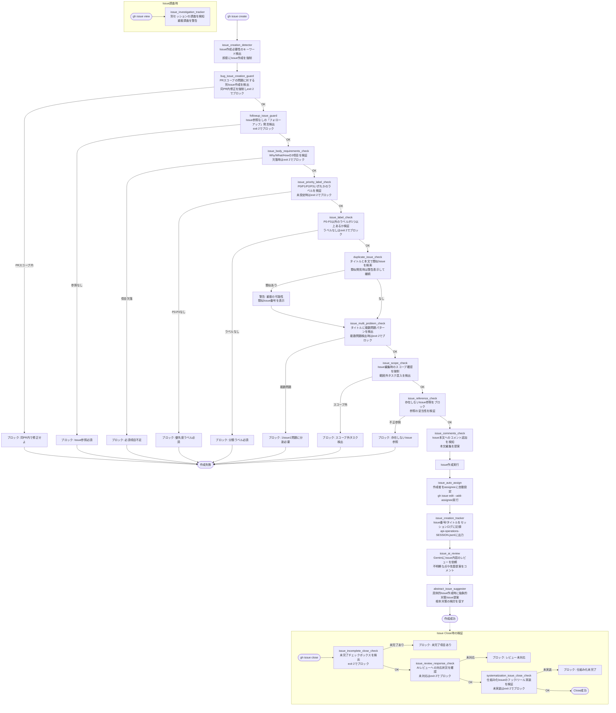
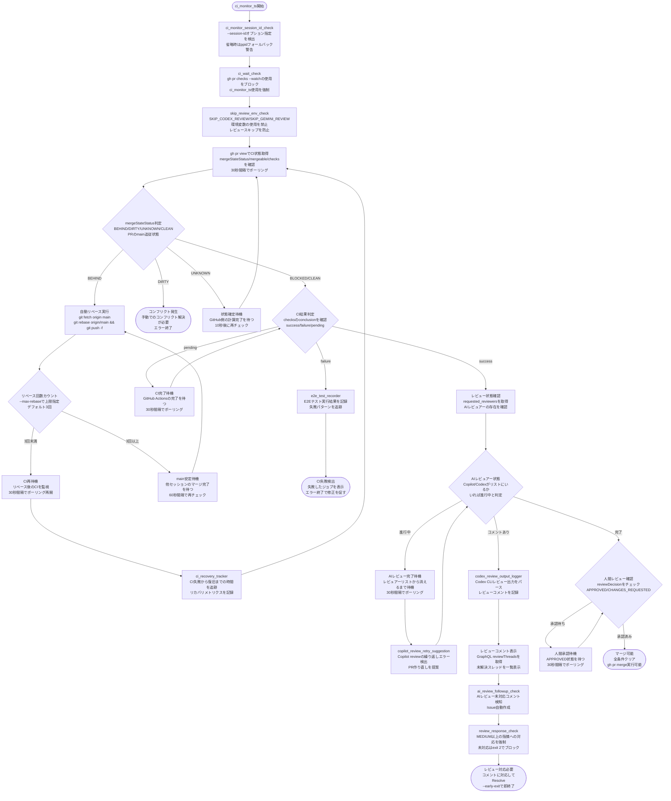
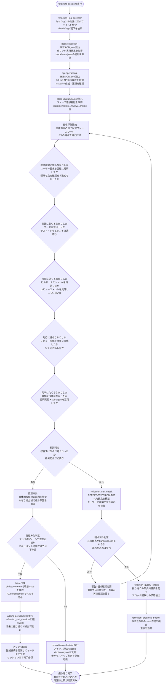
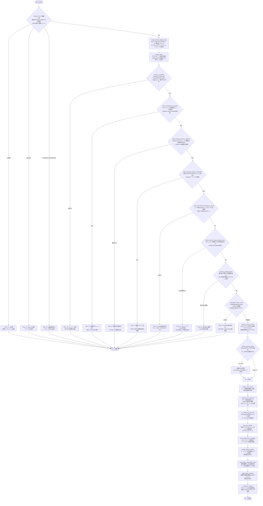
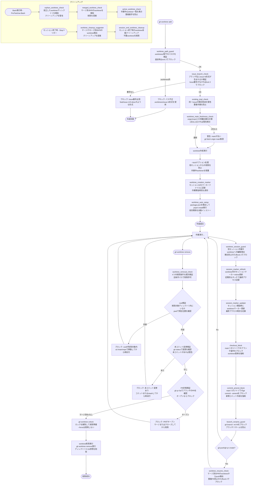

# dekita システムフロー図

開発フローを可視化。フック詳細は[README.md](README.md)を参照。

**注意**: これらの図は**論理的なワークフロー**を示しています。フックの**実行順序**は`settings.json`を参照してください。

生成日時: 2026-02-07

---

## 1. 開発ワークフロー全体像

セッション開始からマージまでの完全サイクル。

```mermaid
flowchart TD
    開始([セッション開始]) --> date[date_context_injector<br/>現在日時とSession IDを表示<br/>フォーマット: YYYY-MM-DD HH:MM:SS JST]
    date --> env_check[environment_integrity_check<br/>settings.jsonとindex.jsonの同期確認<br/>不整合時は自動修正オプションを提案]
    env_check --> env{環境OK?}
    env -->|No| fix[環境修正]
    fix --> env_check
    env -->|Yes| git_check[git_config_check<br/>user.name/user.email設定確認<br/>未設定時は警告表示]
    git_check --> flow_init[flow_state_updater<br/>現在のフェーズを追跡<br/>implementation/review/merge等]
    flow_init --> lefthook[check-lefthook.sh<br/>lefthookのインストール状態確認<br/>未インストール時は警告表示]
    lefthook --> ts_deps[check-ts-hooks-deps.sh<br/>TypeScriptフック依存関係確認<br/>不足時はpnpm install推奨]
    ts_deps --> handoff[session_handoff_reader<br/>.claude/handoff.mdを読み込み表示<br/>前回セッションの継続文脈を提供]

    handoff --> resume_warn[session_resume_warning<br/>transcriptファイル比較で別セッション検出<br/>競合リスクがある場合は警告]
    resume_warn --> file_state[session_file_state_check<br/>セッション再開時のファイル状態検証<br/>競合や意図しない変更を検出]
    file_state --> wt_status[session_worktree_status<br/>全worktreeのロック/ブランチ状態一覧<br/>作業中worktreeを可視化]
    wt_status --> branch_check[branch_check<br/>メインリポジトリのブランチ状態確認<br/>mainブランチであることを検証]
    branch_check --> main_sync[main_sync_check<br/>ローカルmainとorigin/mainの同期確認<br/>1日以上遅れていれば警告]
    main_sync --> hook_dev[hook_dev_warning<br/>worktree内でのフック開発時<br/>変更が反映されない問題を警告]
    hook_dev --> continuation[continuation_session_metrics<br/>継続セッションを検出<br/>前セッションのメトリクス記録]
    continuation --> marker_update[session_marker_updater<br/>worktree内のセッションマーカー更新<br/>最終アクセス時刻を記録]
    marker_update --> wt_integrity[worktree_commit_integrity_check<br/>worktree内のコミット整合性チェック<br/>不正なコミット状態を検出]
    wt_integrity --> issue_integrity[session_issue_integrity_check<br/>セッション別Issue追跡データ整合性検証<br/>データ破損を検出]
    issue_integrity --> fork_advisor[fork_session_collaboration_advisor<br/>fork-session向けに独立Issue候補提案<br/>競合しない作業を推奨]

    fork_advisor --> plan_enforce{計画必須?}
    plan_enforce -->|Yes| planning[planning_enforcement<br/>Issue作業前にPlanファイル作成を強制<br/>未計画はexit 2でブロック]
    planning --> plan_review[plan_ai_review_iterative<br/>Gemini/Codex並列レビュー実行<br/>両モデル承認まで繰り返し]
    plan_review --> plan_exit[plan_ai_review<br/>Plan承認後にAIレビューを実行<br/>設計品質を検証]
    plan_exit --> wt_check{worktree必要?}
    plan_enforce -->|No| wt_check

    wt_check -->|Yes| wt_create[worktree作成]
    wt_check -->|No| wt_move[既存worktreeへ移動]
    wt_create --> wt_guard[worktree_path_guard<br/>.worktrees/配下以外へのパスを検出<br/>違反時はexit 2でブロック]
    wt_guard --> issue_branch[issue_branch_check<br/>ブランチ名にissue-N形式を強制<br/>Issue番号なしはexit 2でブロック]
    issue_branch --> existing_impl[existing_impl_check<br/>worktree作成時に既存実装の存在を警告<br/>重複作業を防止]
    existing_impl --> wt_fresh[worktree_main_freshness_check<br/>mainブランチが1日以上古いか確認<br/>古ければgit fetch origin main推奨]
    wt_fresh --> wt_setup[worktree_auto_setup<br/>package.json検出でpnpm install実行<br/>依存関係を自動インストール]
    wt_setup --> wt_marker[worktree_creation_marker<br/>セッションIDをマーカーファイルに記録<br/>作業開始時刻も保存]
    wt_marker --> impl[実装開始]
    wt_move --> session_marker[session_marker_updater<br/>worktree内のセッションマーカー更新<br/>最終アクセス時刻を記録]
    session_marker --> impl

    impl --> edit[Edit/Write]
    edit --> worktree_warn[worktree_warning<br/>mainブランチでの編集を検出<br/>worktree作成を促すメッセージ表示]
    worktree_warn --> session_guard[worktree_session_guard<br/>別セッション作業中worktreeへの編集検出<br/>競合防止のためexit 2でブロック]
    session_guard --> task_checklist[task_start_checklist<br/>タスク開始時の確認チェックリスト表示<br/>既存worktree/PR/担当者確認を促す]
    task_checklist --> python_guard[python_hook_guard<br/>Pythonフック新規作成をブロック<br/>TypeScript使用を推奨]
    python_guard --> new_py_check[new_python_hook_check<br/>新規Pythonフック追加をブロック<br/>既存移行方針の遵守を強制]
    new_py_check --> issue_first[issue_first_check<br/>問題発見時にIssue作成を先に促す<br/>実装前のIssue化を推奨]
    issue_first --> issue_exist[issue_existence_check<br/>実装開始前にIssue存在を確認<br/>Issue作成を優先]
    issue_exist --> empty_return[empty_return_check<br/>except内での空コレクション返却検出<br/>アンチパターンを警告]
    empty_return --> similar[similar_code_check<br/>変更内容と類似するコードをrg検索<br/>重複実装を防ぐ]
    similar --> security_test[security_bypass_test_reminder<br/>セキュリティガードファイル編集時<br/>バイパステストの追加を促す]
    security_test --> hook_return[hook_return_format_check<br/>フック種類に応じた返却形式検証<br/>誤用を検出]
    hook_return --> doc_edit[doc_edit_check<br/>仕様ドキュメント編集時<br/>関連コード・Issueの確認を促す]
    doc_edit --> ref_comment[reference_comment_check<br/>「〜と同じ」参照スタイルのコメント検出<br/>保守性の低下を警告]
    ref_comment --> parallel_edit[parallel_edit_conflict_check<br/>sibling fork-session間の同一ファイル編集警告<br/>競合リスクを検出]
    parallel_edit --> env_undef[env_undefined_check<br/>process.envへのundefined代入検出<br/>実行時エラーを防止]
    env_undef --> fork_pr_guard[fork_session_pr_guard<br/>fork-sessionが親セッションPRに介入防止<br/>exit 2でブロック]
    fork_pr_guard --> commit[コミット作成]

    commit --> checkout_block[checkout_block<br/>mainリポジトリでのブランチ操作をブロック<br/>worktree使用を強制]
    checkout_block --> commit_amend[commit_amend_block<br/>mainリポジトリでのgit commit --amendをブロック<br/>新規コミット作成を強制]
    commit_amend --> closes_valid[closes_validation<br/>コミットメッセージのCloses/Fixesキーワード整合性<br/>不整合時に警告を表示]
    closes_valid --> commit_marker[commit_marker_update<br/>git commit後にCodexレビューマーカー更新<br/>レビュー状態を追跡]
    commit_marker --> push[git push]

    push --> force_guard[force_push_guard<br/>git push --forceをブロック<br/>--force-with-leaseを推奨]
    force_guard --> research_req[research_requirement_check<br/>Issue/PR作成前にWeb調査を強制<br/>最新情報確認を促す]
    research_req --> codex_logger[codex_review_logger<br/>Codex CLIレビュー実行をログ記録<br/>codex-review-checkと連携]
    codex_logger --> codex_review[codex_review_check<br/>codex review --base mainの実行確認<br/>未実行時はexit 2でブロック]
    codex_review -->|未実行| impl
    codex_review -->|実行済み| gemini_logger[gemini_review_logger<br/>Gemini CLIレビュー実行をログ記録<br/>gemini-review-checkと連携]
    gemini_logger --> gemini_review[gemini_review_check<br/>Gemini CLIレビュー実行確認<br/>未実行時はexit 2でブロック]
    gemini_review -->|未実行| impl
    gemini_review -->|実行済み| simplifier[code_simplifier_check<br/>simplifying-code Skill実行強制<br/>PR作成前の簡素化チェック]
    simplifier -->|未実行| impl
    simplifier -->|実行済み| pr_create[PR作成]

    pr_create --> dup_pr[duplicate_pr_check<br/>同一ブランチの既存PR検出<br/>重複PR作成を警告]
    dup_pr --> closes_kw[closes_keyword_check<br/>gh pr create時にClosesキーワード確認<br/>追加を提案]
    closes_kw --> closes_scope[closes_scope_check<br/>未完了タスクのあるIssueをClose検出<br/>exit 2でブロック]
    closes_scope --> pr_scope[pr_scope_check<br/>1 Issue = 1 PRルールを強制<br/>複数Issue対応をブロック]
    pr_scope --> pr_overlap[pr_overlap_check<br/>他PRとのファイル重複を警告<br/>競合リスクを検出]
    pr_overlap --> pr_related[pr_related_issue_check<br/>関連オープンIssueの確認を促す<br/>見落とし防止]
    pr_related --> pr_test[pr_test_coverage_check<br/>変更されたフックのテストカバレッジ確認<br/>テスト不足を警告]
    pr_test --> pr_body[pr_body_quality_check<br/>PRボディに「なぜ」と参照#番号が必須<br/>欠落時はexit 2でブロック]
    pr_body --> pr_defer[pr_defer_check<br/>PR説明文に「後で」系キーワード検出<br/>Issue参照なしはexit 2でブロック]
    pr_defer --> pr_alignment[pr_issue_alignment_check<br/>対象Issueの受け入れ条件を検証<br/>未完了項目を警告]
    pr_alignment --> pr_assign[pr_issue_assign_check<br/>Closesで参照されるIssueのアサイン確認<br/>自動アサイン実行]
    pr_assign --> ci[CI監視開始]

    ci --> ci_monitor[ci_monitor_ts<br/>CI状態/レビュー状態を定期ポーリング<br/>BEHIND時は自動リベース実行]
    ci_monitor --> ci_result{CI結果}
    ci_result -->|失敗| e2e_check[e2e_test_check<br/>CI E2E失敗後のローカルテスト実行強制<br/>再現確認をブロック]
    e2e_check --> ci_fix[CI失敗修正]
    ci_fix --> impl
    ci_result -->|成功| review[レビュー待機]

    review --> review_check{レビュー完了?}
    review_check -->|コメントあり| review_respond[レビュー対応]
    review_respond --> review_resp_chk[review_response_check<br/>MEDIUM以上の指摘への対応を強制<br/>未対応はexit 2でブロック]
    review_resp_chk --> resolve[resolve_thread_guard<br/>Resolveにはコメント返信が必須<br/>返信なしResolveをexit 2でブロック]
    resolve --> reply_resolve[reply_resolve_enforcer<br/>レビューコメント返信後のResolve実行強制<br/>対応完了の明示]
    reply_resolve --> review
    review_check -->|承認| merge_check[merge_check<br/>AIレビュー完了/スレッド解決確認<br/>条件未達時はexit 2でブロック]

    merge_check -->|block| review
    merge_check -->|pass| coderabbit[coderabbit_review_check<br/>CodeRabbitのactionable comments確認<br/>未対応はexit 2でブロック]
    coderabbit -->|未対応| review
    coderabbit -->|対応済み| accept_criteria[acceptance_criteria_reminder<br/>対象Issueの受け入れ条件未完了警告<br/>チェックボックス確認を促す]
    accept_criteria --> issue_req_remind[issue_requirements_reminder<br/>PRマージ前にIssue要件の未完了項目を警告<br/>見落とし防止]
    issue_req_remind --> merge[マージ実行]

    merge --> merge_result[merge_result_check<br/>マージ結果を確認し記録<br/>成功/失敗を判定]
    merge_result --> cleanup[worktree_auto_cleanup<br/>マージ成功後にworktreeを自動削除<br/>mainに戻ってgit pullを促す]
    cleanup --> pull_remind[pr_merge_pull_reminder<br/>mainでgit pullを促すメッセージ表示<br/>ローカルmainを最新化]
    pull_remind --> plan_update[plan_file_updater<br/>計画ファイルのチェックボックス自動更新<br/>完了タスクをマーク]
    plan_update --> flow_complete[post_merge_flow_completion<br/>フローステップ自動完了<br/>ワークフロー状態を更新]
    flow_complete --> similar_search[similar_pattern_search<br/>コードベース内の類似パターンを検索<br/>修正漏れを防ぐ]
    similar_search --> obs_issue[post_merge_observation_issue<br/>動作確認Issueを自動作成<br/>マージ後の検証タスク生成]
    obs_issue --> reflect_enforce[post_merge_reflection_enforcer<br/>PRマージ成功後に振り返りを即時実行<br/>reflecting-sessionsを強制]
    reflect_enforce --> metrics[session_metrics_collector<br/>ツール使用回数/ブロック回数を記録<br/>セッション効率分析用データ]
    metrics --> handoff_write[session_handoff_writer<br/>作業内容を.claude/handoff.mdに保存<br/>次回セッションへの引き継ぎ]
    handoff_write --> reflect_check[reflection_completion_check<br/>reflecting-sessions実行済みかtranscriptで確認<br/>未実行時はexit 2でブロック]
    reflect_check -->|未実行| do_reflect["reflecting-sessions実行"]
    do_reflect --> 終了([セッション終了])
    reflect_check -->|実行済み| 終了
```

---

## 2. Issue作成フロー

Issue作成時の品質チェックと自動処理。Issue close時の検証も含む。

---

## 3. CI監視フロー

PR作成後の継続的監視と自動対応（ci_monitor_ts）。

---

## 4. セッション管理フロー

セッションのライフサイクル管理と状態注入。

```mermaid
flowchart TD
    開始([Claude Code起動]) --> date[date_context_injector<br/>YYYY-MM-DD Weekday HH:MM:SS GMT+9形式で現在日時を表示<br/>Session IDをUUID形式で出力]
    date --> session_id[Session ID取得<br/>Claude CodeのセッションIDを取得<br/>ログのセッション紐付けに使用]
    session_id --> env_check[environment_integrity_check<br/>settings.jsonのフック定義とindex.jsonを比較<br/>不整合があれば修正オプションを提案]

    env_check --> env_ok{環境整合性判定<br/>全フックが正しく登録されているか<br/>不整合があれば再同期}
    env_ok -->|No| env_fix[環境修正提案<br/>sync-hooks実行を提案<br/>自動修正オプションを表示]
    env_fix --> env_check
    env_ok -->|Yes| git_check[git_config_check<br/>git config user.name/user.emailを確認<br/>未設定の場合は警告表示]

    git_check --> flow_init[flow_state_updater<br/>現在のフェーズを追跡<br/>implementation/review/merge等]
    flow_init --> lefthook[check-lefthook.sh<br/>lefthookのインストール状態確認<br/>未インストール時は警告表示]
    lefthook --> ts_deps[check-ts-hooks-deps.sh<br/>TypeScriptフック依存関係確認<br/>不足時はpnpm install推奨]
    ts_deps --> handoff_read[session_handoff_reader<br/>.claude/handoff.mdの内容を表示<br/>前回セッションの作業内容と引き継ぎ事項]
    handoff_read --> resume_warn[session_resume_warning<br/>transcriptファイル比較で別セッション検出<br/>競合リスクがある場合は警告]
    resume_warn --> file_state[session_file_state_check<br/>セッション再開時のファイル状態検証<br/>競合や意図しない変更を検出]
    file_state --> wt_status[session_worktree_status<br/>git worktree listの結果を整形表示<br/>各worktreeのロック状態とブランチ名]
    wt_status --> branch_check[branch_check<br/>メインリポジトリのブランチ状態確認<br/>mainブランチであることを検証]
    branch_check --> main_sync[main_sync_check<br/>ローカルmainとorigin/mainの同期確認<br/>1日以上遅れていれば警告]
    main_sync --> hook_dev[hook_dev_warning<br/>worktree内でのフック開発時<br/>変更が反映されない問題を警告]
    hook_dev --> continuation[continuation_session_metrics<br/>継続セッションを検出<br/>前セッションのメトリクス記録とフローリマインダー]
    continuation --> marker_update[session_marker_updater<br/>worktree内のセッションマーカー更新<br/>最終アクセス時刻を記録]
    marker_update --> wt_integrity[worktree_commit_integrity_check<br/>worktree内のコミット整合性チェック<br/>不正なコミット状態を検出]
    wt_integrity --> issue_integrity[session_issue_integrity_check<br/>セッション別Issue追跡データ整合性検証<br/>データ破損を検出]
    issue_integrity --> fork_advisor[fork_session_collaboration_advisor<br/>fork-session向けに独立Issue候補提案<br/>競合しない作業を推奨]

    fork_advisor --> context[コンテキスト表示<br/>セッション開始情報をまとめて出力<br/>ユーザーに現状を共有]

    context --> ups_start[UserPromptSubmit発火]
    ups_start --> ups_pr[open_pr_warning<br/>オープンPR一覧と担当ブランチ表示<br/>介入禁止PRを警告]
    ups_pr --> ups_obs[observation_session_reminder<br/>未確認の動作確認Issueをリマインド<br/>セッション開始時に警告表示]
    ups_obs --> ups_fork[fork_session_id_updater<br/>fork-session検出時にSession ID更新<br/>親セッションとの区別に使用]
    ups_fork --> ups_feedback[feedback_detector<br/>ユーザーフィードバックパターンを検出<br/>検出時は仕組み化を促すリマインド]
    ups_feedback --> ups_pending[immediate_pending_check<br/>未実行のIMMEDIATEタグを検出<br/>検出時はexit 2でブロック]
    ups_pending --> ups_creation[issue_creation_detector<br/>Issue作成必要性のキーワード検出<br/>即座にIssue作成を強制]
    ups_creation --> ready([セッション準備完了<br/>全初期化処理完了<br/>作業開始可能])

    ready --> work[作業実行中...]
    work --> stop_trigger{Stop検知<br/>セッション終了シグナルを検出<br/>Ctrl+Cまたは明示的終了}
    stop_trigger -->|No| work

    stop_trigger -->|Yes| flow_update[flow_state_updater<br/>最終フェーズ状態を記録<br/>完了/中断を判定]
    flow_update --> flow_verify[flow_verifier<br/>ワークフロー追跡を検証<br/>レポートを生成]
    flow_verify --> stop_review[stop_auto_review<br/>未レビューの変更を検出<br/>レビュー実行を促す]
    stop_review --> block_resp[block_response_tracker<br/>ブロック後のテキストのみ応答検知<br/>ツール呼び出しなしを警告]
    block_resp --> bypass_anal[bypass_analysis<br/>回避パターンを分析<br/>警告を表示]
    bypass_anal --> askuser_sug[askuser_suggestion<br/>選択肢をテキストで列挙するパターン検出<br/>AskUserQuestionツール使用を提案]
    askuser_sug --> defer_kw[defer_keyword_check<br/>「後で」キーワードを検出<br/>Issue作成との照合を行う]
    defer_kw --> merge_conf[merge_confirmation_warning<br/>「マージしますか？」パターン検出<br/>原則違反を警告]
    merge_conf --> hook_effect[hook_effectiveness_evaluator<br/>セッション中のフック実行を分析<br/>改善提案を出力]
    hook_effect --> hook_behavior[hook_behavior_evaluator<br/>フックの期待動作と実際の動作ギャップ検知<br/>自動検知システム]
    hook_behavior --> metrics[session_metrics_collector<br/>ツール使用回数/ブロック回数を集計<br/>session-metrics.logに出力]
    metrics --> outcome[session_outcome_collector<br/>作成したPR/Issue数をカウント<br/>セッション成果を記録]
    outcome --> log_health[log_health_check<br/>ログの健全性を自動検証<br/>欠損や異常を検出]
    log_health --> handoff_write[session_handoff_writer<br/>作業内容を.claude/handoff.mdに保存<br/>次回セッションへの引き継ぎ情報]
    handoff_write --> secret_deploy[secret_deploy_check<br/>未デプロイのフロントエンドシークレット確認<br/>VITEプレフィックスの変更検出]
    secret_deploy --> cwd[cwd_check<br/>現在のcwdが存在するか確認<br/>削除済みworktree内なら警告]
    cwd --> git_status[git_status_check<br/>未コミット変更の有無を確認<br/>変更があれば警告表示]
    git_status --> related_task[related_task_check<br/>セッション内作成Issueのステータス確認<br/>未完了ならexit 2でブロック]
    related_task --> problem_report[problem_report_check<br/>問題報告とIssue作成の整合性確認<br/>未Issue化の問題をブロック]
    problem_report --> user_feedback_sys[user_feedback_systematization_check<br/>ユーザーフィードバック検出時の仕組み化確認<br/>ACTION_REQUIREDで警告]
    user_feedback_sys --> systematization[systematization_check<br/>教訓が仕組み化されたか確認<br/>ドキュメントのみはACTION_REQUIRED]
    systematization --> flow_effect[flow_effect_verifier<br/>未完了フローがある場合にブロック<br/>セッション終了を防止]
    flow_effect --> wt_cleanup_sug[worktree_cleanup_suggester<br/>マージ/クローズ済みPRのworktree検出<br/>クリーンアップを提案]
    wt_cleanup_sug --> session_wt_clean[session_end_worktree_cleanup<br/>セッション終了時のworktree自動クリーンアップ<br/>不要worktreeを削除]
    session_wt_clean --> log_compress[session_log_compressor<br/>ローテート済みログを圧縮<br/>ディスク容量を節約]
    log_compress --> main_check[session_end_main_check<br/>mainブランチが最新か確認<br/>遅れていればgit pullを促す]
    main_check --> reflect_complete[reflection_completion_check<br/>transcriptでreflecting-sessions実行を確認<br/>未実行時はexit 2でブロック]
    reflect_complete -->|未実行| block_reflect[ブロック: 振り返り必須<br/>reflecting-sessions Skillの実行必要<br/>セッション終了をブロック]
    block_reflect --> work
    reflect_complete -->|実行済み| reflect_quality[reflection_quality_check<br/>振り返りの形式的評価を防ぐ<br/>ブロック回数との矛盾検出]
    reflect_quality --> reflect_self[reflection_self_check<br/>振り返りの観点網羅性を確認<br/>抜けがあればブロック]
    reflect_self --> issue_req[issue_creation_request_check<br/>Issue作成依頼の即時作成を強制<br/>未対応をexit 2でブロック]
    issue_req --> lesson_issue[lesson_issue_check<br/>振り返り時の教訓がIssue化確認<br/>未Issue化をブロック]
    lesson_issue --> vague_action[vague_action_block<br/>曖昧な対策表現（精神論）検出<br/>ACTION_REQUIRED警告]
    vague_action --> immediate_action[immediate_action_check<br/>PRマージ後のreflecting-sessions実行を強制<br/>IMMEDIATEタグの実行確認]
    immediate_action --> review_promise[review_promise_tracker<br/>レビュー約束の履行を追跡<br/>未履行の約束を警告]
    review_promise --> todo_check[session_todo_check<br/>TodoWriteの未完了項目を検出<br/>in_progress/pendingがあれば警告]
    todo_check --> false_positive[false_positive_detector<br/>誤検知パターンを検出して警告<br/>フック改善の提案]
    false_positive --> plan_checklist[plan_checklist_guard<br/>計画ファイルの未完了チェックリスト検出<br/>exit 2でブロック]
    plan_checklist --> plan_exit[plan_mode_exit_check<br/>planファイル作成後のExitPlanMode検証<br/>呼び出し漏れをブロック]
    plan_exit --> phase_prog[phase_progression_guard<br/>Phase完了時に次Phaseの開始を強制<br/>確認なしで自動進行]
    phase_prog --> conservative[conservative_behavior_check<br/>保守的行動パターンを検出<br/>exit 2でブロック]
    conservative --> 終了([セッション終了<br/>全終了処理完了<br/>安全にセッションを終了])
```

---

## 5. フック実行フロー

イベント駆動のパイプライン処理。各トリガーで実行されるフックの詳細。

```mermaid
flowchart TD
    開始([イベント発火]) --> trigger{triggerタイプ}

    trigger -->|SessionStart| ss[SessionStartフック<br/>全18フック実行<br/>詳細はフロー4参照]
    ss --> exec

    trigger -->|UserPromptSubmit| ups[UserPromptSubmitフック<br/>全6フック実行<br/>詳細はフロー4参照]
    ups --> exec

    trigger -->|PreToolUse| pre_flow[flow_state_updater<br/>現在のフェーズを追跡<br/>全ツールで発火 matcher: .*]
    pre_flow --> matcher_pre{matcher照合}

    matcher_pre -->|"navigate_page/new_page"| prod_url[production_url_warning<br/>本番環境URLへのアクセスを検出<br/>dekita.app/api.dekita.appで警告]
    prod_url --> exec

    matcher_pre -->|Skill| reflect_log[reflection_log_collector<br/>振り返りスキル実行時<br/>セッションログを自動集計して提供]
    reflect_log --> exec

    matcher_pre -->|AskUserQuestion| merit_demerit[merit_demerit_check<br/>選択肢にメリット/デメリット分析必須<br/>不足時はexit 2でブロック]
    merit_demerit --> closed_issue_opt[closed_issue_in_options_check<br/>選択肢にクローズ済みIssue検出<br/>クローズ済みならexit 2でブロック]
    closed_issue_opt --> exec

    matcher_pre -->|ExitPlanMode| plan_iterative[plan_ai_review_iterative<br/>Gemini/Codex並列レビュー実行<br/>両モデル承認まで繰り返し]
    plan_iterative --> exec

    matcher_pre -->|"Edit/Write"| edit_guards
    subgraph edit_guards [Edit/Write ガード群]
        ew_python[python_hook_guard<br/>Pythonフック新規作成をブロック<br/>TypeScript使用を推奨]
        ew_new_py[new_python_hook_check<br/>新規Pythonフック追加をブロック<br/>既存移行方針の遵守を強制]
        ew_session[worktree_session_guard<br/>別セッション作業中worktreeへの編集検出<br/>競合防止のためexit 2でブロック]
        ew_task[task_start_checklist<br/>タスク開始時の確認チェックリスト表示<br/>既存worktree/PR/担当者確認を促す]
        ew_warn[worktree_warning<br/>mainブランチでの編集を検出<br/>worktree作成を促すメッセージ表示]
        ew_empty[empty_return_check<br/>except内での空コレクション返却検出<br/>アンチパターンを警告]
        ew_similar[similar_code_check<br/>変更内容と類似コードをrg検索<br/>重複実装防止の警告表示]
        ew_security[security_bypass_test_reminder<br/>セキュリティガードファイル編集時<br/>バイパステストの追加を促す]
        ew_return[hook_return_format_check<br/>フック種類に応じた返却形式検証<br/>誤用を検出]
        ew_doc[doc_edit_check<br/>仕様ドキュメント編集時<br/>関連コード・Issueの確認を促す]
        ew_ref[reference_comment_check<br/>「〜と同じ」参照スタイルのコメント検出<br/>保守性の低下を警告]
        ew_parallel[parallel_edit_conflict_check<br/>sibling fork-session間の同一ファイル編集<br/>競合リスクを警告]
        ew_issue_exist[issue_existence_check<br/>実装開始前にIssue存在を確認<br/>Issue作成を優先]
        ew_env[env_undefined_check<br/>process.envへのundefined代入検出<br/>実行時エラーを防止]
        ew_issue_first[issue_first_check<br/>問題発見時にIssue作成を先に促す<br/>実装前のIssue化を推奨]
        ew_fork[fork_session_pr_guard<br/>fork-sessionが親セッションPRに介入防止<br/>exit 2でブロック]
    end
    edit_guards --> exec

    matcher_pre -->|Bash| bash_guards
    subgraph bash_guards [Bash ガード群 - 主要フック抜粋]
        b_task[task_start_checklist<br/>タスク開始時の確認チェックリスト<br/>既存worktree/PR/担当者確認]
        b_issue_branch[issue_branch_check<br/>ブランチ名にissue-N形式を強制<br/>Issue番号なしはexit 2でブロック]
        b_dep[dependency_check_reminder<br/>依存関係追加時にContext7/Web検索を促す<br/>最新情報確認を推奨]
        b_open_issue[open_issue_reminder<br/>セッション開始時にオープンIssueをリマインド<br/>未解決問題を意識させる]
        b_orphan[orphan_worktree_check<br/>孤立したworktreeディレクトリを検知<br/>クリーンアップを警告]
        b_merged[merged_worktree_check<br/>マージ済みPRのworktreeを検知<br/>削除を提案]
        b_active[active_worktree_check<br/>作業中worktree一覧を表示<br/>重複着手を防止]
        b_migration[migration_bug_check<br/>移行PRでの移行先バグ検出<br/>同PR内修正を推奨]
        b_checkout[checkout_block<br/>mainリポジトリでのブランチ操作をブロック<br/>worktree使用を強制]
        b_amend[commit_amend_block<br/>mainリポジトリでのgit commit --amendをブロック<br/>新規コミット作成を強制]
        b_rename[branch_rename_guard<br/>git branch -m/-Mをブロック<br/>ブランチリネームを防止]
        b_planning[planning_enforcement<br/>Issue作業前にPlanファイル作成を強制<br/>未計画はexit 2でブロック]
        b_research[research_requirement_check<br/>Issue/PR作成前にWeb調査を強制<br/>最新情報確認を促す]
        b_overwrite[file_overwrite_warning<br/>Bashでの既存ファイル上書き時に警告<br/>意図しない上書きを防止]
        b_multi[multi_issue_guard<br/>1 worktree/PRで複数Issue同時対応を警告<br/>スコープ拡大を防止]
        b_lint[subprocess_lint_check<br/>Pythonフック内の問題あるsubprocess使用検出<br/>安全なパターンを推奨]
        b_hook_change[hook_change_detector<br/>フックファイル変更を含むコミットを検出<br/>テスト確認を促す]
        b_hooks_design[hooks_design_check<br/>新規フックファイルの設計チェック<br/>設計原則の遵守を確認]
        b_ui[ui_check_reminder<br/>フロントエンド変更時にブラウザ確認を強制<br/>視覚的な確認を促す]
        b_skill[skill_usage_reminder<br/>特定操作の前にSkill使用を強制<br/>ワークフロー遵守を促す]
        b_workflow[workflow_skill_reminder<br/>worktree/PR作成時にSkill参照をリマインド<br/>手順の標準化]
        b_dependabot[dependabot_skill_reminder<br/>Dependabot PR操作時にSkill参照を促す<br/>専用手順の遵守]
        b_uv[uv_run_guard<br/>worktree内でのuv run使用を防止<br/>代替コマンドを推奨]
        b_reviewer[reviewer_removal_check<br/>AIレビュアー削除をブロック<br/>レビュープロセスの維持]
        b_invest[issue_investigation_tracker<br/>gh issue view実行時に別セッション調査を検知<br/>重複調査を警告]
        b_api_timer[api_operation_timer<br/>外部APIコマンドの開始時刻を記録<br/>api-operation-loggerと連携]
        b_force[force_push_guard<br/>git push --forceをブロック<br/>--force-with-leaseを推奨]
        b_fork[fork_session_pr_guard<br/>fork-sessionが親セッションPRに介入防止<br/>exit 2でブロック]
    end
    bash_guards --> exec

    trigger -->|PostToolUse| post_flow[flow_state_updater<br/>現在のフェーズを追跡<br/>全ツールで発火 matcher: .*]
    post_flow --> post_marker[session_marker_refresh<br/>worktree内のセッションマーカーmtime更新<br/>定期的なタッチで最終アクセス記録]
    post_marker --> post_simplifier[code_simplifier_logger<br/>code-simplifier実行をログ記録<br/>簡素化実施状況を追跡]
    post_simplifier --> post_script[script_error_ignore_warning<br/>スクリプトエラー無視防止<br/>エラーハンドリング不足を警告]
    post_script --> matcher_post{matcher照合}

    matcher_post -->|Bash| post_bash
    subgraph post_bash [PostToolUse:Bash - 主要フック抜粋]
        pb_wt_create[worktree_creation_marker<br/>worktree作成時にセッションIDを記録<br/>作業開始時刻も保存]
        pb_secret[secret_deploy_trigger<br/>VITEプレフィックスのシークレット更新を記録<br/>デプロイ必要性を追跡]
        pb_e2e[e2e_test_recorder<br/>E2Eテスト実行結果を記録<br/>テスト状態を追跡]
        pb_bash_fail[bash_failure_tracker<br/>連続Bash失敗を検知<br/>シェル破損時に引き継ぎプロンプト生成を提案]
        pb_bypass[bypass_detector<br/>回避行動を検知<br/>セッションログに記録]
        pb_doc_ref[doc_reference_warning<br/>Bash失敗時にドキュメント参照の古さ検出<br/>更新を促す]
        pb_pr_metrics[pr_metrics_collector<br/>PRメトリクスを自動収集<br/>作成から完了までのデータ記録]
        pb_ci_recovery[ci_recovery_tracker<br/>CI失敗から復旧までの時間を追跡<br/>リカバリメトリクスを記録]
        pb_tool_eff[tool_efficiency_tracker<br/>ツール呼び出しパターンを追跡<br/>非効率なパターンを検出]
        pb_git_ops[git_operations_tracker<br/>Git操作メトリクスを追跡<br/>操作頻度と成功率を記録]
        pb_issue_track[issue_creation_tracker<br/>Issue番号/タイトルをセッションログに記録<br/>実装を促す]
        pb_issue_ai[issue_ai_review<br/>Issue作成後にAIレビューを実行<br/>品質向上を促す]
        pb_phase[phase_issue_auto_continuation<br/>Phase Issueクローズ後に次Phase Issue自動作成<br/>段階的進行を自動化]
        pb_dev_workflow[development_workflow_tracker<br/>開発ワークフローの開始を追跡<br/>フェーズ遷移を記録]
        pb_reflect_remind[reflection_reminder<br/>PRマージや一定アクション後に振り返りリマインド<br/>定期的な振り返りを促す]
        pb_post_merge_reflect[post_merge_reflection_enforcer<br/>PRマージ成功後に振り返り即時実行<br/>reflecting-sessionsを強制]
        pb_merge_result[merge_result_check<br/>マージ結果を確認し記録<br/>成功/失敗を判定]
        pb_review_action[review_comment_action_reminder<br/>レビューコメント読み込み後にアクション継続を促す<br/>テキストのみ応答を防止]
        pb_wt_cleanup[worktree_auto_cleanup<br/>マージ成功後にworktree削除を提案<br/>mainディレクトリへのcd推奨]
        pb_wt_setup[worktree_auto_setup<br/>worktree作成成功後にsetup_worktree.sh実行<br/>依存関係を自動インストール]
        pb_plan[plan_file_updater<br/>gh pr merge成功後に計画ファイル更新<br/>完了タスクをマーク]
        pb_pull[pr_merge_pull_reminder<br/>mainでgit pullを促すメッセージ表示<br/>ローカルmainを最新化]
        pb_flow_complete[post_merge_flow_completion<br/>フローステップ自動完了<br/>ワークフロー状態を更新]
        pb_obs_issue[post_merge_observation_issue<br/>動作確認Issueを自動作成<br/>マージ後の検証タスク生成]
        pb_obs_auto[observation_auto_check<br/>操作成功時に動作確認Issueのチェック項目更新<br/>自動検証]
        pb_obs_remind[observation_reminder<br/>マージ成功後に未確認の動作確認Issueリマインド<br/>検証忘れ防止]
        pb_copilot[copilot_review_retry_suggestion<br/>Copilot reviewの繰り返しエラー検出<br/>PR作り直しを提案]
        pb_codex_out[codex_review_output_logger<br/>Codex CLIレビュー出力をパース<br/>レビューコメントを記録]
        pb_commit_mark[commit_marker_update<br/>git commit後にCodexレビューマーカー更新<br/>レビュー状態を追跡]
        pb_flow_prog[flow_progress_tracker<br/>フローステップの完了を追跡<br/>進捗を記録]
        pb_reflect_prog[reflection_progress_tracker<br/>振り返り中のIssue作成を検出<br/>進捗を追跡]
        pb_api_log[api_operation_logger<br/>外部APIコマンドの実行詳細をログ記録<br/>実行時間とエラー率を分析]
        pb_review_promise[review_promise_tracker<br/>レビュー返信で約束したIssue作成を追跡<br/>未履行の約束を警告]
        pb_tool_sub[tool_substitution_detector<br/>パッケージマネージャ実行とツール代替パターンを追跡<br/>最適ツール使用を推奨]
        pb_similar[similar_pattern_search<br/>PRマージ後にコードベース内の類似パターン検索<br/>修正漏れを防ぐ]
        pb_block_imp[block_improvement_reminder<br/>同一フックの連続ブロックを検知<br/>フック改善を提案]
        pb_abstract[abstract_issue_suggester<br/>具体的Issue作成時に抽象的対策Issue提案<br/>根本対策の検討を促す]
        pb_reply_resolve[reply_resolve_enforcer<br/>レビューコメント返信後のResolve実行強制<br/>対応完了の明示]
        pb_rule[rule_enforcement_check<br/>ルール違反パターンを検出<br/>AGENTS.md準拠を確認]
    end
    post_bash --> exec

    matcher_post -->|Write| post_write
    subgraph post_write [PostToolUse:Write]
        pw_dogfood[dogfooding_reminder<br/>スクリプト作成・変更時に実データテストを促す<br/>Dogfooding原則の遵守]
        pw_scope[scope_check<br/>作業中Issueへのスコープ外タスク混入を検出<br/>スコープ維持を強制]
        pw_rule[rule_consistency_check<br/>ルール定義の一貫性を確認<br/>矛盾を検出して警告]
    end
    post_write --> exec

    matcher_post -->|Edit| post_edit
    subgraph post_edit [PostToolUse:Edit]
        pe_rework[rework_tracker<br/>同一ファイルへの短時間複数編集を追跡<br/>手戻りパターンを検出]
        pe_rule[rule_consistency_check<br/>ルール定義の一貫性を確認<br/>矛盾を検出して警告]
        pe_tool_eff[tool_efficiency_tracker<br/>ツール呼び出しパターンを追跡<br/>非効率なパターンを検出]
        pe_script[script_test_reminder<br/>新関数追加時にテスト追加をリマインド<br/>テストカバレッジ維持]
        pe_dogfood[dogfooding_reminder<br/>スクリプト変更時に実データテストを促す<br/>Dogfooding原則の遵守]
        pe_regex[regex_pattern_reminder<br/>正規表現パターン実装時にチェックリスト表示<br/>AGENTS.md準拠を確認]
    end
    post_edit --> exec

    matcher_post -->|"Read/Glob/Grep"| post_read
    subgraph post_read [PostToolUse:Read/Glob/Grep]
        pr_tool_eff[tool_efficiency_tracker<br/>探索ツール呼び出しパターンを追跡<br/>非効率なパターンを検出]
        pr_explore[exploration_tracker<br/>探索深度を追跡<br/>Read/Glob/Grep使用回数を記録]
        pr_obs[observation_auto_check<br/>操作成功時に動作確認Issueのチェック更新<br/>自動検証]
        pr_filesize[file_size_warning<br/>大きすぎるファイルの読み込み時<br/>リファクタリングを促す警告]
    end
    post_read --> exec

    matcher_post -->|"WebSearch/WebFetch"| post_web[research_tracker<br/>セッション内のWebSearch/WebFetch使用を追跡<br/>調査活動を記録]
    post_web --> exec

    matcher_post -->|Skill| post_skill
    subgraph post_skill [PostToolUse:Skill]
        ps_fail[skill_failure_detector<br/>Skill呼び出し失敗を検出<br/>調査・Issue化を促す]
        ps_mismatch[doc_implementation_mismatch_detector<br/>ドキュメントと実装の乖離を検出<br/>Issue作成を強制]
    end
    post_skill --> exec

    matcher_post -->|Task| post_task[doc_implementation_mismatch_detector<br/>ドキュメントと実装の乖離を検出<br/>Issue作成を強制]
    post_task --> exec

    matcher_post -->|ExitPlanMode| plan_ai[plan_ai_review<br/>Plan承認後にAIレビューを実行<br/>設計品質を検証]
    plan_ai --> exec

    trigger -->|Stop| stop[Stopフック<br/>全41フック実行<br/>詳細はフロー4参照]
    stop --> exec

    matcher_pre -->|非マッチ| skip[スキップ: 該当フックなし]
    matcher_post -->|非マッチ| skip
    skip --> 終了_pass([pass: 継続])

    exec[フック実行] --> result{実行結果}
    result -->|exit 0 + メッセージ| 終了_info([info: 情報表示して継続])
    result -->|exit 0 + 出力なし| 終了_pass

    result -->|exit 2| 終了_block([block: 処理停止<br/>ユーザー対応が必要])
    result -->|exception| fail_open{fail-open設定}
    fail_open -->|有効| 終了_warn([warn: 警告表示して継続])
    fail_open -->|無効| 終了_error([error: エラー表示して継続])
```

---

## 6. 振り返りフロー

reflecting-sessionsコマンドによる改善サイクル。

---

## 7. マージ条件チェックフロー

gh pr merge時の段階的検証。GitHubブランチ保護とmerge_checkの2段階。

---

## 8. worktree管理フロー

並列開発環境のライフサイクル制御。

