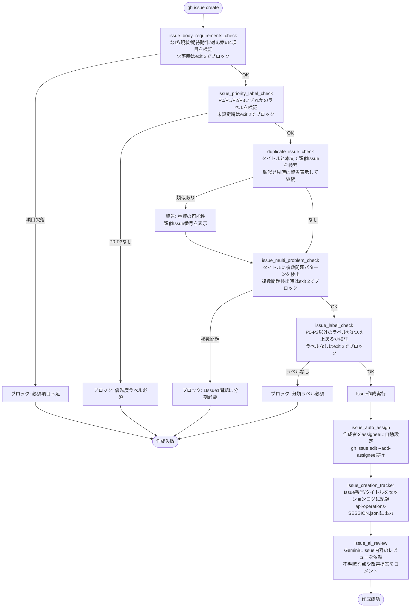
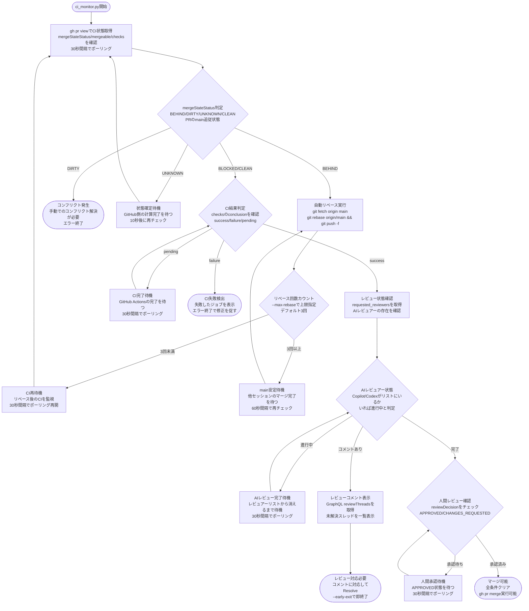
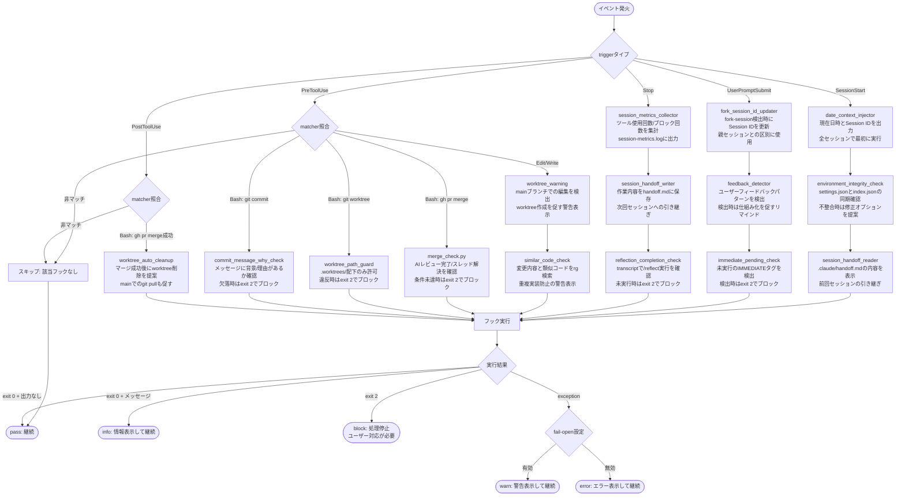
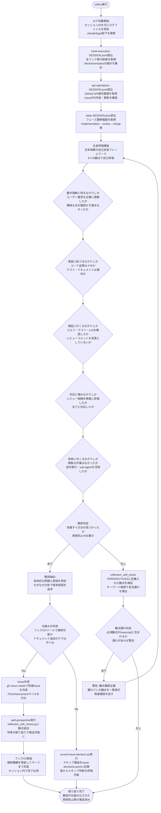
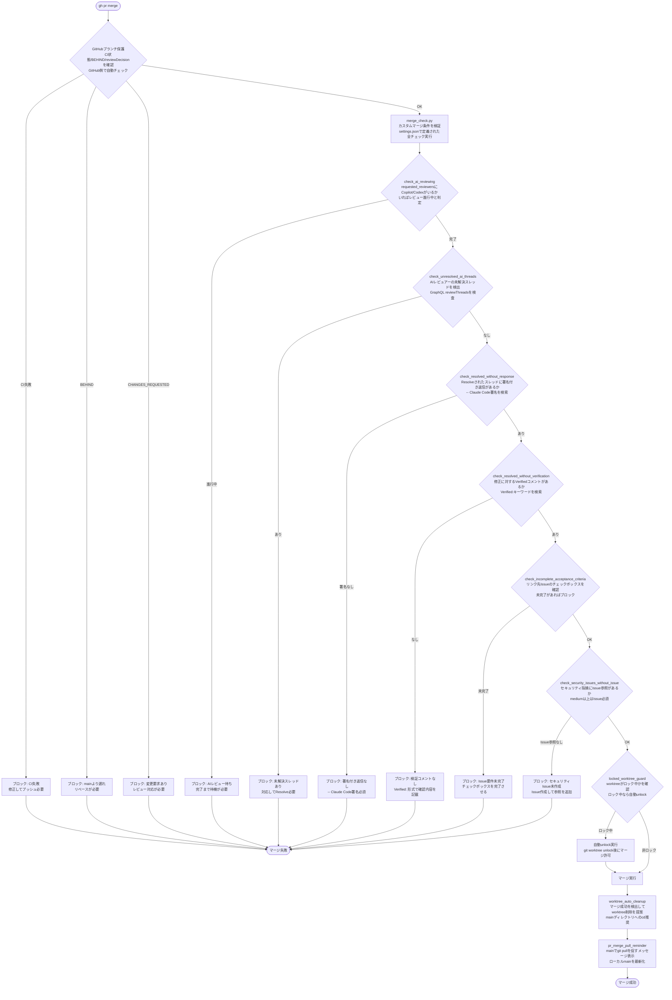
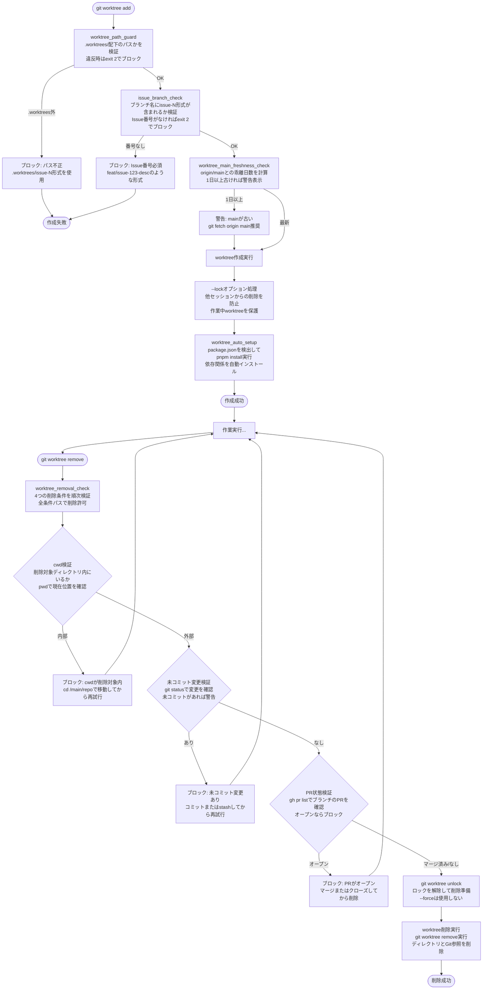

# dekita システムフロー図

開発フローを可視化。フック詳細は[README.md](README.md)を参照。

---

## 1. 開発ワークフロー全体像

セッション開始からマージまでの完全サイクル。

```mermaid
flowchart TD
    開始([セッション開始]) --> date[date_context_injector<br/>現在日時とSession IDを表示<br/>フォーマット: YYYY-MM-DD HH:MM:SS JST]
    date --> env_check[environment_integrity_check<br/>settings.jsonとindex.jsonの同期確認<br/>不整合時は自動修正オプションを提案]
    env_check --> env{環境OK?}
    env -->|No| fix[環境修正]
    fix --> env_check
    env -->|Yes| git_check[git_config_check<br/>user.name/user.email設定確認<br/>未設定時は警告表示]
    git_check --> handoff[session_handoff_reader<br/>.claude/handoff.mdを読み込み表示<br/>前回セッションの継続文脈を提供]

    handoff --> wt_status[session_worktree_status<br/>全worktreeのロック/ブランチ状態一覧<br/>作業中worktreeを可視化]
    wt_status --> pr_warn[open_pr_warning<br/>オープンPR一覧と担当ブランチ表示<br/>介入禁止PRを警告]
    pr_warn --> resume_warn[session_resume_warning<br/>別セッションが作業中のworktreeを検出<br/>競合リスクを警告]
    resume_warn --> wt_check{worktree必要?}
    wt_check -->|Yes| wt_create[worktree作成]
    wt_check -->|No| wt_move[既存worktreeへ移動]
    wt_create --> wt_guard[worktree_path_guard<br/>.worktrees/配下以外へのパスを検出<br/>違反時はexit 2でブロック]
    wt_guard --> impl[実装開始]
    wt_move --> impl

    impl --> edit[Edit/Write]
    edit --> worktree_warn[worktree_warning<br/>mainブランチでの編集を検出<br/>worktree作成を促すメッセージを表示]
    worktree_warn --> similar[similar_code_check<br/>変更内容と類似するコードをrg検索<br/>重複実装を防ぐ]
    similar --> commit[コミット作成]

    commit --> commit_why[commit_message_why_check<br/>コミットメッセージに「なぜ」が必須<br/>欠落時はexit 2でブロック]
    commit_why -->|block| impl
    commit_why -->|pass| push[git push]

    push --> codex_review[codex_review_check<br/>codex review --base mainの実行を確認<br/>未実行時はexit 2でブロック]
    codex_review -->|未実行| impl
    codex_review -->|実行済み| pr_create[PR作成]

    pr_create --> pr_body[pr_body_quality_check<br/>PRボディに「なぜ」と参照#番号が必須<br/>欠落時はexit 2でブロック]
    pr_body --> ci[CI監視開始]
    ci --> ci_monitor[ci_monitor.py<br/>CI状態/レビュー状態を定期ポーリング<br/>BEHIND時は自動リベース実行]
    ci_monitor --> ci_result{CI結果}
    ci_result -->|失敗| ci_fix[CI失敗修正]
    ci_fix --> impl
    ci_result -->|成功| review[レビュー待機]

    review --> review_check{レビュー完了?}
    review_check -->|コメントあり| review_respond[レビュー対応]
    review_respond --> resolve[resolve_thread_guard<br/>Resolveにはコメント返信が必須<br/>返信なしResolveをexit 2でブロック]
    resolve --> review
    review_check -->|承認| merge_check[merge_check.py<br/>AIレビュー完了/スレッド解決/検証コメント確認<br/>条件未達時はexit 2でブロック]

    merge_check -->|block| review
    merge_check -->|pass| merge[マージ実行]

    merge --> cleanup[worktree_auto_cleanup<br/>マージ成功後にworktreeを自動削除<br/>mainに戻ってgit pullを促す]
    cleanup --> metrics[session_metrics_collector<br/>ツール使用回数/ブロック回数を記録<br/>セッション効率分析用データ]
    metrics --> handoff_write[session_handoff_writer<br/>作業内容を.claude/handoff.mdに保存<br/>次回セッションへの引き継ぎ]
    handoff_write --> reflect_check[reflection_completion_check<br/>/reflect実行済みかtranscriptで確認<br/>未実行時はexit 2でブロック]
    reflect_check -->|未実行| do_reflect["reflect実行"]
    do_reflect --> 終了([セッション終了])
    reflect_check -->|実行済み| 終了
```

---

## 2. Issue作成フロー

Issue作成時の品質チェックと自動処理。

---

## 3. CI監視フロー

PR作成後の継続的監視と自動対応。

---

## 4. セッション管理フロー

セッションのライフサイクル管理と状態注入。

```mermaid
flowchart TD
    開始([Claude Code起動]) --> date[date_context_injector<br/>YYYY-MM-DD HH:MM:SS JST形式で現在日時を表示<br/>Session IDをUUID形式で出力]
    date --> session_id[Session ID取得<br/>Claude CodeのセッションIDを取得<br/>ログのセッション紐付けに使用]
    session_id --> env_check[environment_integrity_check<br/>settings.jsonのフック定義とindex.jsonを比較<br/>不整合があれば修正オプションを提案]

    env_check --> env_ok{環境整合性判定<br/>全フックが正しく登録されているか<br/>不整合があれば再同期}
    env_ok -->|No| env_fix[環境修正提案<br/>sync-hooks.pyの実行を提案<br/>自動修正オプションを表示]
    env_fix --> env_check
    env_ok -->|Yes| git_check[git_config_check<br/>git config user.name/user.emailを確認<br/>未設定の場合は警告表示]

    git_check --> handoff_read[session_handoff_reader<br/>.claude/handoff.mdの内容を表示<br/>前回セッションの作業内容と引き継ぎ事項]
    handoff_read --> flow_state[flow_state_updater<br/>現在のフェーズを追跡<br/>implementation/review/mergeなど]
    flow_state --> context[コンテキスト表示<br/>セッション開始情報をまとめて出力<br/>ユーザーに現状を共有]

    context --> wt_status[session_worktree_status<br/>git worktree listの結果を整形表示<br/>各worktreeのロック状態とブランチ名]
    wt_status --> active_wt[active_worktree_check<br/>ロック中のworktreeを検出<br/>他セッションが作業中の可能性を警告]
    active_wt --> pr_warn[open_pr_warning<br/>gh pr listでオープンPR一覧を取得<br/>介入禁止PRを赤字で警告表示]
    pr_warn --> resume_warn[session_resume_warning<br/>transcriptファイル比較で別セッション検出<br/>競合リスクがある場合は警告]
    resume_warn --> fork_check[fork_session_collaboration_advisor<br/>fork-session向けに独立Issue候補を提案<br/>競合しない作業を推奨]
    fork_check --> ready([セッション準備完了<br/>全初期化処理完了<br/>作業開始可能])

    ready --> work[作業実行...]
    work --> stop_trigger{Stop検知<br/>セッション終了シグナルを検出<br/>Ctrl+Cまたは明示的終了}
    stop_trigger -->|No| work

    stop_trigger -->|Yes| metrics[session_metrics_collector<br/>Read/Write/Bash等のツール使用回数を集計<br/>session-metrics.logに出力]
    metrics --> outcome[session_outcome_collector<br/>作成したPR/Issue数をカウント<br/>セッション成果を記録]
    outcome --> handoff_write[session_handoff_writer<br/>作業内容を.claude/handoff.mdに保存<br/>次回セッションへの引き継ぎ情報]
    handoff_write --> todo_check[session_todo_check<br/>TodoWriteの未完了項目を検出<br/>in_progress/pendingがあれば警告]
    todo_check -->|未完了あり| warn_todo[警告表示<br/>未完了タスクの一覧を表示<br/>完了または引き継ぎを促す]
    warn_todo --> reflect_check[reflection_completion_check<br/>transcriptで/reflect実行を検索<br/>未実行ならexit 2でブロック]
    todo_check -->|なし| reflect_check

    reflect_check -->|未実行| block_reflect[ブロック: 振り返り必須<br/>/reflect Skillの実行が必要<br/>セッション終了をブロック]
    block_reflect --> work
    reflect_check -->|実行済み| cwd[cwd_check<br/>現在のcwdが存在するか確認<br/>削除済みworktree内なら警告]
    cwd --> git_status[git_status_check<br/>未コミット変更の有無を確認<br/>変更があれば警告表示]
    git_status --> 終了([セッション終了<br/>全終了処理完了<br/>安全にセッションを終了])
```

---

## 5. フック実行フロー

イベント駆動のパイプライン処理。

---

## 6. 振り返りフロー

reflectコマンドによる改善サイクル。

---

## 7. マージ条件チェックフロー

gh pr merge時の段階的検証。GitHubブランチ保護とmerge_check.pyの2段階。

---

## 8. worktree管理フロー

並列開発環境のライフサイクル制御。

