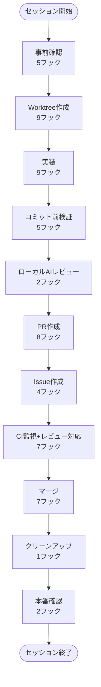

# dekita 開発フロー図

## 開発ワークフロー全体像

---

## フェーズ詳細

### セッション開始

セッション開始時の自動フック発動

**期待されるフック:**

- `date_context_injector`
- `check-lefthook.sh`
- `session_handoff_reader`
- `open_pr_warning`
- `branch_check`

### 事前確認

Issue/worktree/PRの確認

**期待されるフック:**

- `open_issue_reminder`
- `task_start_checklist`
- `research_requirement_check`
- `planning_enforcement`
- `locked_worktree_guard`

### Worktree作成

Issue用worktreeの作成

**期待されるフック:**

- `worktree_path_guard`
- `orphan_worktree_check`
- `merged_worktree_check`
- `active_worktree_check`
- `issue_auto_assign`
- `development_workflow_tracker`
- `git_operations_tracker`
- `flow_progress_tracker`
- `worktree_main_freshness_check`

### 実装

コード編集・変更

**期待されるフック:**

- `worktree_warning`
- `empty_return_check`
- `ui_check_reminder`
- `dependency_check_reminder`
- `hooks_design_check`
- `rework_tracker`
- `tool_efficiency_tracker`
- `exploration_tracker`
- `research_tracker`

### コミット前検証

lint/test/typecheckの実行

**期待されるフック:**

- `python_lint_check`
- `existing_impl_check`
- `bash_failure_tracker`
- `e2e_test_check`
- `e2e_test_recorder`

### ローカルAIレビュー

codex reviewの実行

**期待されるフック:**

- `codex_review_logger`
- `codex_review_output_logger`

### PR作成

PRの作成とレビュー依頼

**期待されるフック:**

- `codex_review_check`
- `pr_scope_check`
- `closes_keyword_check`
- `closes_validation`
- `pr_issue_assign_check`
- `pr_overlap_check`
- `pr_issue_alignment_check`
- `pr_metrics_collector`

### Issue作成

問題発見時のIssue作成

**期待されるフック:**

- `issue_label_check`
- `issue_scope_check`
- `issue_creation_tracker`
- `issue_ai_review`

### CI監視+レビュー対応

CI完了待ちとレビューコメント対応

**期待されるフック:**

- `ci_wait_check`
- `ci_recovery_tracker`
- `copilot_review_retry_suggestion`
- `issue_comments_check`
- `issue_review_response_check`
- `recurring_problem_block`
- `reflection_reminder`

### マージ

PRのマージ

**期待されるフック:**

- `merge_check`
- `reviewer_removal_check`
- `force_push_guard`
- `issue_incomplete_close_check`
- `worktree_auto_cleanup`
- `pr_merge_pull_reminder`
- `resolve_thread_guard`

### クリーンアップ

worktree削除とmain pull

**期待されるフック:**

- `worktree_removal_check`

### 本番確認

本番環境でのデプロイ確認

**期待されるフック:**

- `production_url_warning`
- `secret_deploy_trigger`

### セッション終了

セッション終了時の評価・振り返り

**期待されるフック:**

- `hook_effectiveness_evaluator`
- `hook_behavior_evaluator`
- `session_metrics_collector`
- `session_handoff_writer`
- `secret_deploy_check`
- `cwd_check`
- `git_status_check`
- `related_task_check`
- `problem_report_check`
- `systematization_check`
- `flow_effect_verifier`
- `reflection_prompt`
- `worktree_cleanup_suggester`
- `session_end_worktree_cleanup`

