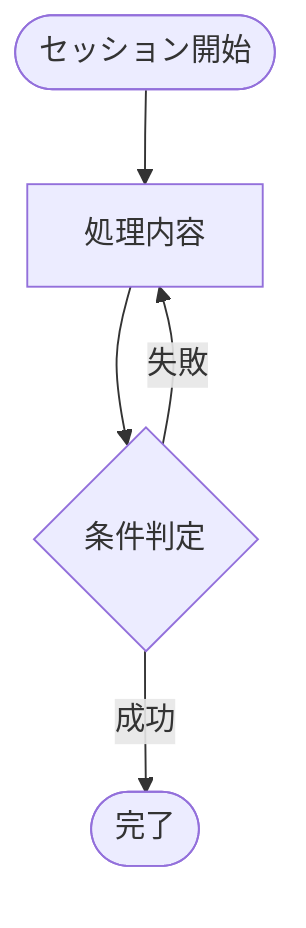

# flows.md 生成プロンプト

開発フロー全体をMermaid図で可視化し、`.fdp/flows.md` を生成する。

---

## 目的

「この操作でどのような流れになるか」を**具体的に**可視化する。

- **テーブル禁止**: 全てMermaid図で表現
- **具体化**: 個別フック名を列挙し、それぞれの動作を詳細に説明
- **フロー重視**: 名前の羅列ではなく、処理の流れを図示

---

## 入力ファイル

| ファイル | 用途 |
|----------|------|
| `.fdp/index.json` | フック一覧と説明 |
| `.claude/settings.json` | trigger/matcher情報 |

---

## 出力

`.fdp/flows.md` - 8つのMermaid図を含むMarkdownファイル

---

## Mermaid記法

全て `flowchart TD`（Top-Down）で記述:



**ノード形状**:
- `([テキスト])` - 開始/終了（楕円）
- `[テキスト]` - 処理（矩形）
- `{テキスト}` - 判定（菱形）

**遷移**:
- `-->` - 単純遷移
- `-->|条件|` - 条件付き遷移

**コマンド名の記述ルール**:
- `/reflect` のようなコマンド名をノードのテキストとして使用する場合、Mermaidの構文エラーを避けるために以下のルールに従ってください。
  1. 先頭のスラッシュ `/` を削除します。（例: `/reflect実行` → `reflect実行`）
  2. 修正したテキストをダブルクォート `"` で囲んでノードに記述します。
- 例:
  - ❌ `node[/reflect実行]` (構文エラーになります)
  - ✅ `node["reflect実行"]`

---

## 8つのシステムフロー

### 1. 開発ワークフロー全体像

セッション開始からマージまでの完全サイクル。

```
セッション開始 → SessionStartフック（environment_integrity_check, session_handoff_reader等） →
worktree作成/移動 → 実装 → コミット → PreToolUseフック（commit_message_why_check等） →
push → PR作成 → CI監視 → レビュー対応 → マージ →
worktree削除 → Stopフック（session_metrics_collector, session_handoff_writer等） → セッション終了
```

**含めるべき概念**:
- セッション初期化
- フック実行タイミング（Pre/Post/Stop）
- CI/レビューループ
- マージ後のクリーンアップ

### 2. Issue作成フロー

Issue作成時の品質チェックと自動処理。

```
gh issue create検出 → issue_body_requirements_check → issue_priority_label_check →
duplicate_issue_check → issue_scope_check → 成功/ブロック →
issue_auto_assign → issue_creation_tracker → issue_ai_review
```

**含めるべき概念**:
- 各チェックフックを個別に表示
- ブロック時の分岐
- 自動処理

### 3. CI監視フロー

PR作成後の継続的監視と自動対応。

```
ci_monitor.py開始 → CI状態確認 →
BEHIND検知 → 自動リベース → CI再待機 /
CI成功 → レビュー待機 → コメント確認 →
対応 → Resolve → マージ可能判定
```

**含めるべき概念**:
- BEHIND/DIRTY/UNKNOWN状態
- 自動リベース
- レビューループ

### 4. セッション管理フロー

セッションのライフサイクル管理。

```
セッション開始 → Session ID取得 → 環境チェック →
引き継ぎ読込 → 状態注入 → 作業中... →
Stop検知 → メトリクス収集 → 引き継ぎ書出 → 終了
```

**含めるべき概念**:
- 環境整合性チェック
- 引き継ぎ（handoff）機構
- メトリクス収集

### 5. フック実行フロー

イベント駆動のパイプライン処理。

```
イベント発火 → matcher照合 → 該当フック抽出 →
順次実行 → 結果判定 →
block → 処理停止 /
warn → 警告表示・継続 /
pass → 次のフック /
error → fail-open継続
```

**含めるべき概念**:
- trigger/matcher
- 結果レベル（block/warn/pass/error）
- fail-open機構

### 6. 振り返りフロー

/reflectコマンドによる改善サイクル。

```
/reflect実行 → ログ収集 → 五省評価 →
教訓抽出 → 仕組み化判定 →
Issue作成 → perspective追加 → 完了
```

**含めるべき概念**:
- ログ分析
- 五省
- 教訓の仕組み化

### 7. マージ条件チェックフロー

gh pr merge時の段階的検証。

```
gh pr merge検出 → CI成功確認 → BEHIND確認 →
レビュー承認確認 → スレッドResolved確認 →
Issue要件確認 → AIレビュー完了確認 →
マージ実行 → クリーンアップ
```

**含めるべき概念**:
- 12+の条件を抽象化
- 各条件でのブロック分岐

### 8. worktree管理フロー

並列開発環境のライフサイクル制御。

```
worktree作成要求 → パスガード → Issue紐付けチェック →
main最新確認 → ロック取得 → 作成 →
... → 削除要求 → ロック解除 → cwd確認 → 削除
```

**含めるべき概念**:
- ロック機構
- 削除時のcwdチェック
- 自動クリーンアップ

---

## 生成手順

1. `.fdp/index.json` を読み込み、フックの概要を把握
2. `.claude/settings.json` を読み込み、trigger/matcherを把握
3. 8つのフローそれぞれについて:
   - 関連するフックを特定
   - **具体的なフック名を列挙**し、各フックの動作を詳細に説明
   - flowchart TD形式で処理の流れを図示
4. 全8図を `.fdp/flows.md` に出力

---

## 出力フォーマット

```markdown
# dekita システムフロー図

開発フローを可視化。フック詳細は[README.md](README.md)を参照。

## 1. 開発ワークフロー全体像

\`\`\`mermaid
flowchart TD
    開始([セッション開始]) --> date[date_context_injector<br/>現在日時とSession IDを表示<br/>フォーマット: YYYY-MM-DD HH:MM:SS]
    date --> env_check[environment_integrity_check<br/>settings.jsonとindex.jsonの同期確認<br/>不整合時は自動修正を提案]
    env_check --> env{環境OK?}
    env -->|Yes| handoff[session_handoff_reader<br/>前回セッションのhandoff.mdを表示<br/>継続作業の文脈を提供]
    env -->|No| 修正[環境修正]
    修正 --> env_check

    handoff --> work[worktree作成/移動]
    work --> impl[実装]
    impl --> commit[コミット]
    commit --> why_check[commit_message_why_check<br/>コミットメッセージに「なぜ」が必須<br/>欠落時はexit 2でブロック]
    why_check -->|pass| push[push]
    why_check -->|block| impl

    push --> pr[PR作成]
    pr --> ci[CI監視]
    ci --> review[レビュー対応]
    review --> merge{マージ可能?}
    merge -->|Yes| do_merge[マージ実行]
    merge -->|No| review

    do_merge --> cleanup[worktree_auto_cleanup<br/>マージ成功後にworktreeを自動削除<br/>mainに戻ってgit pullを促す]
    cleanup --> metrics[session_metrics_collector<br/>ツール使用回数、ブロック回数等を記録<br/>セッション効率の分析に使用]
    metrics --> 終了([セッション終了])
\`\`\`

## 2. Issue作成フロー
...
```

---

## 注意事項

- **テーブル禁止**: 全ての情報をMermaid図で表現
- **具体化優先**: 個別フック名を列挙し、「〜フック群」という抽象表現は**禁止**
- **フック説明は3行構成**: 各フックノードは以下の3行で説明する（`<br/>`で改行）:
  1. **フック名**: `hook_name`
  2. **動作説明**: 何をチェック/実行するか（具体的に）
  3. **結果/条件**: ブロック条件、出力内容、または効果

  **良い例**:
  ```
  node[commit_message_why_check<br/>コミットメッセージに「なぜ」が必須<br/>欠落時はexit 2でブロック]
  node[session_handoff_reader<br/>前回セッションのhandoff.mdを表示<br/>継続作業の文脈を提供]
  node[worktree_path_guard<br/>.worktrees/配下以外へのworktree作成を検出<br/>違反時はexit 2でブロック]
  ```

  **悪い例**（情報不足）:
  ```
  ❌ node[worktree_path_guard<br/>パス検証] → 何を検証？結果は？
  ❌ node[environment_integrity_check<br/>環境整合性チェック] → 何の整合性？
  ❌ node[SessionStartフック群] → どのフックが発火？
  ```

- **日本語統一**: ノード名、ラベルは全て日本語
- **フロー重視**: 「何があるか」ではなく「どう流れるか」を図示
- **現実的なノード数**: 各図は30-60ノード程度に収める（詳細説明のため増加OK）
