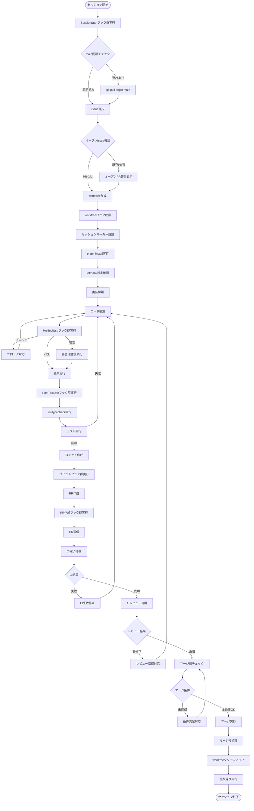
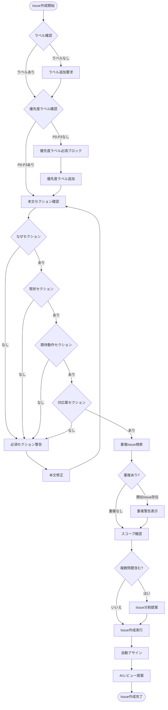
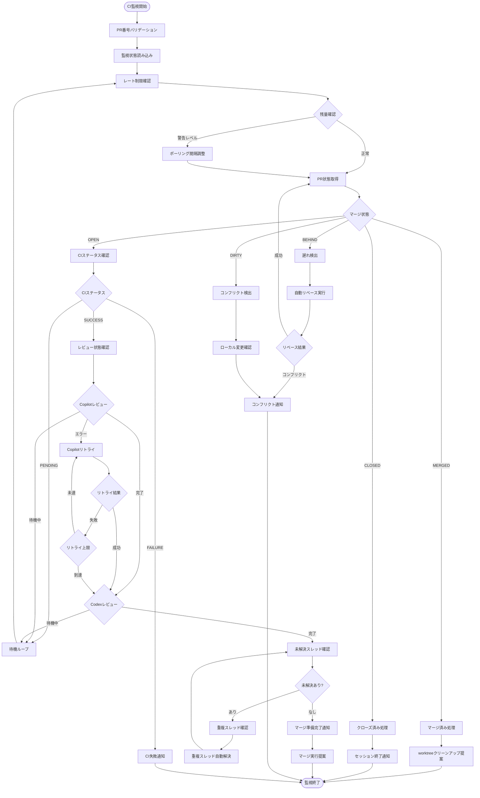
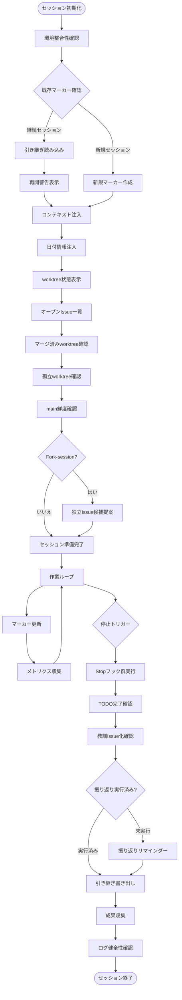
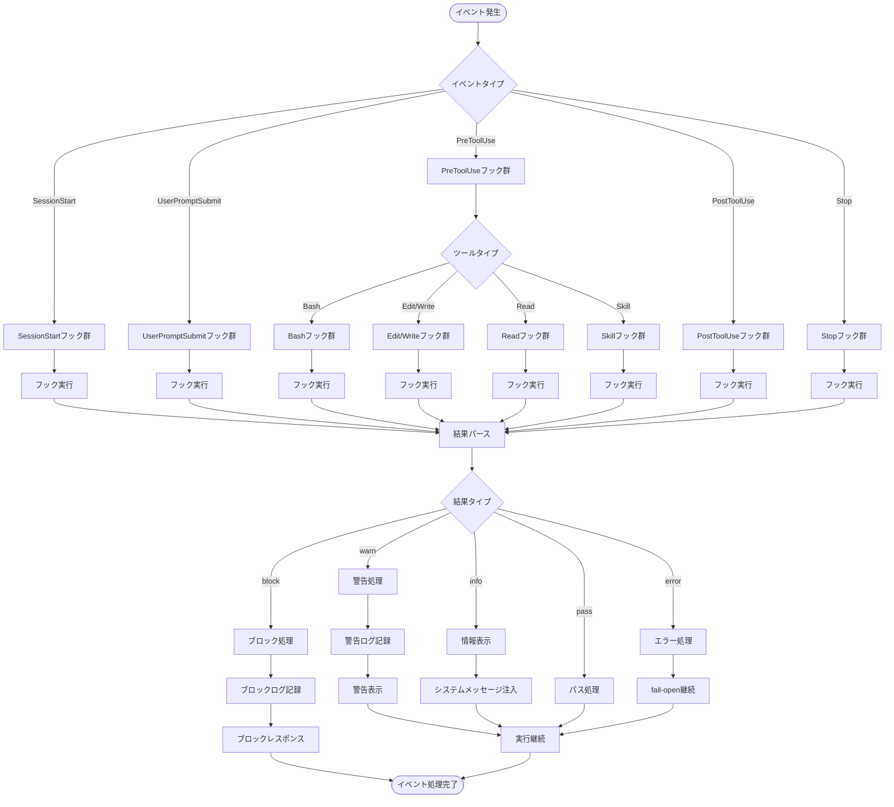
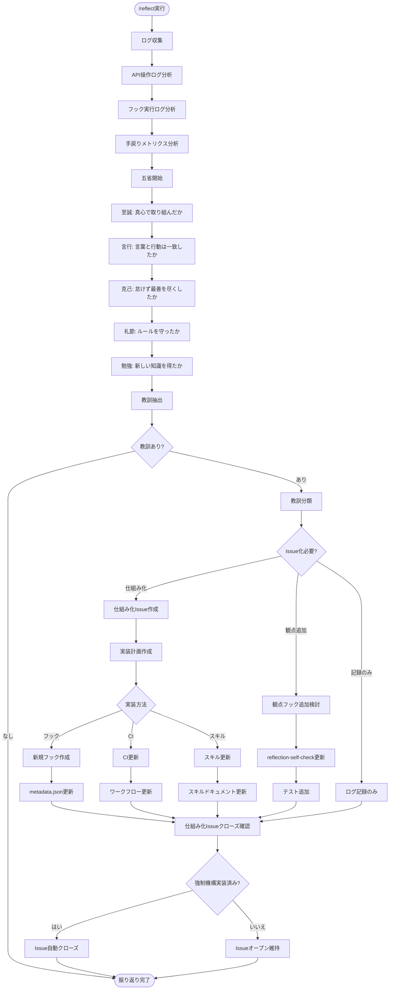
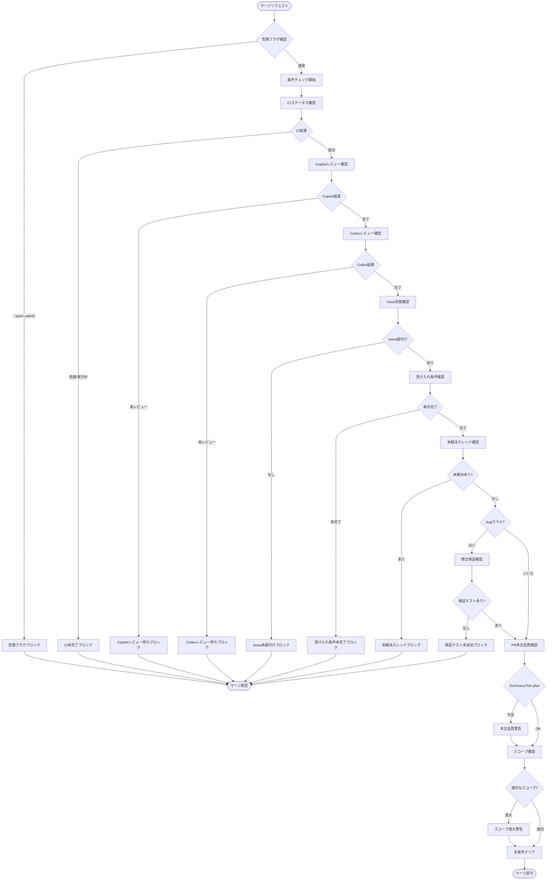
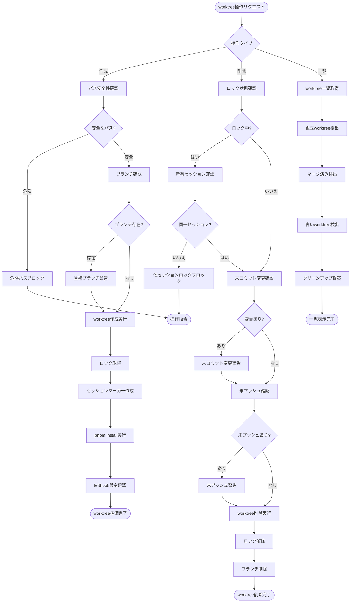

# dekita! システムフロー図

## 1. 開発ワークフロー全体像

Issue着手からPRマージまでの完全な開発サイクル。worktree運用による並列開発、CI監視、AIレビュー対応を含む。

## 2. Issue作成フロー

Issue作成時の品質チェックと自動処理。優先度ラベル、必須セクション、重複検出を含む。

## 3. CI監視フロー

PR作成後のCI監視、自動リベース、AIレビュー対応を含む継続監視プロセス。

## 4. セッション管理フロー

セッション開始から終了までのライフサイクル管理。状態注入、マーカー管理、引き継ぎを含む。

## 5. フック実行フロー

Claude Codeフックの実行パイプライン。イベント検出、フック選択、結果処理を含む。

## 6. 振り返りフロー

/reflectコマンドによる振り返りプロセス。五省、教訓抽出、Issue化、仕組み化を含む。

## 7. マージ条件チェックフロー

PRマージ前の12+条件チェック。AIレビュー、CI、Issue状態、テストカバレッジを含む。

## 8. worktree管理フロー

worktreeのライフサイクル管理。作成、ロック、セッション追跡、クリーンアップを含む。

