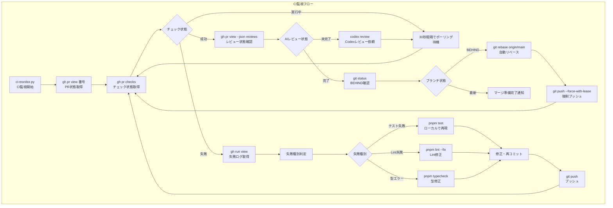

# 全ファイル説明

対象リポジトリに含まれる**全ての**ファイルを網羅的に説明し、**Markdownファイルとして保存**してください。

---

## 重要ルール（必ず確認）

| ルール | 説明 |
|--------|------|
| **Mermaid必須** | flows.mdは `flowchart TD` のMermaid形式のみ。**ASCII art（`┌───`, `│`, `▼` 等）は禁止** |
| **ノード形式** | `[実装名.py<br/>説明]` 形式必須。説明だけのノード（`[Issue確認]`等）は禁止 |
| **最低要件** | 全体フロー30ノード以上、ユースケース6個以上（各15ノード以上） |
| **省略禁止** | 「主要な〜」「約N個」「〜など」「〜を参照」は全て禁止 |

---

## 重要: 出力方針

**このタスクは大量のファイル（100+）を対象とするため、以下の方針で実行すること。**

1. **ディレクトリに出力**: 結果は `generated/explain-all/{プロジェクト名}/` ディレクトリに複数ファイルとして保存する
   - FDPプロジェクトルートの `generated/explain-all/{プロジェクト名}/` ディレクトリに出力
   - プロジェクト名は対象リポジトリのディレクトリ名を使用
2. **カテゴリごとにファイル分割**: 探索結果に基づいてカテゴリを動的に決定し、カテゴリごとに別ファイルを生成
3. **生成日時を記載**: 各ファイル冒頭に `date` コマンドで取得した生成日時を記載する
4. **省略禁止**: 「主要な〜」「代表的な〜」「など」で省略しない。全ファイルを列挙する
5. **中間ファイル**: 作業中に中間ファイルが必要な場合は、`generated/explain-all/{プロジェクト名}/tmp/` ディレクトリに作成する

### 出力ファイル構成

```
generated/explain-all/{プロジェクト名}/
├── tmp/
│   └── all-files.txt       # 中間ファイル（全ファイル一覧）
├── 00-summary.md           # 必須：サマリー・目次・生成日時
├── {カテゴリ1}.md          # 探索結果から動的に決定
├── {カテゴリ2}.md          # 探索結果から動的に決定
├── ...
└── flows.md                # 必須：フロー図
```

- **00-summary.md**: 全体サマリー、各カテゴリへのリンク、ファイル数統計
- **{カテゴリ}.md**: 探索結果に基づいて論理的に分類したカテゴリごとのファイル
- **flows.md**: 全体フロー図、ユースケース別フロー図

**カテゴリの決め方**:
- 第1階層は**ディレクトリ階層**を基準にする（分類の安定性を優先）
- 第2階層で**機能/用途ラベル**を併記し、意味づけを明確にする
- 探索結果の構造と機能的なまとまりから動的に決定
- 各カテゴリファイルは独立して完結すること

---

## 探索方針（中間ファイル必須）

**最初に全ファイル一覧を中間ファイルに出力し、それを参照しながら進める。**

### Step 1: 出力ディレクトリと中間ファイルを作成

```bash
mkdir -p generated/explain-all/{プロジェクト名}/tmp
find {対象ディレクトリ} -type f | sort > generated/explain-all/{プロジェクト名}/tmp/all-files.txt
wc -l generated/explain-all/{プロジェクト名}/tmp/all-files.txt  # 件数を確認
```

この中間ファイルが「説明すべき全ファイル」の正解リストになる。

### Step 2: カテゴリ分類

中間ファイルを見ながら、ファイルを論理的なカテゴリに分類する。

### Step 3: カテゴリごとにファイル生成

`generated/explain-all/{プロジェクト名}/` ディレクトリにカテゴリごとのファイルを生成していく。

### Step 4: カテゴリ単位で検証

各カテゴリファイル生成後、そのカテゴリの件数を検証：

```bash
# カテゴリ内のファイル数（中間ファイルから抽出）
grep "該当パターン" generated/explain-all/{プロジェクト名}/tmp/all-files.txt | wc -l

# 出力ファイルのテーブル行数
grep -c "^|" generated/explain-all/{プロジェクト名}/{カテゴリ}.md
```

### Step 5: 全体検証

全カテゴリ完了後、全体の件数を検証：

```bash
# 中間ファイルの行数（説明すべき数）
wc -l generated/explain-all/{プロジェクト名}/tmp/all-files.txt

# 全出力ファイルのテーブル行数合計（説明した数）
grep -c "^|" generated/explain-all/{プロジェクト名}/*.md | tail -1
```

**数が一致しない場合は完了とせず、漏れを特定して追記する。**

---

## 禁止事項

- 「主要な〜」「代表的な〜」「主な〜」のような表現で一部だけを説明すること
- 要約やまとめ形式での説明
- 「など」「等」で省略すること
- **「約N個」「~N個」のような曖昧な数値**（サマリー含め全箇所で正確な数を記載すること）
- **「〜を参照」で済ませること**（このドキュメント内で完結させる）
- **会話に直接大量出力すること**（必ずファイルに書き込む）
- **カバレッジ100%未満で完了とすること**（全ファイルを列挙するまで終わらない）

**「約」禁止はサマリーにも適用される**: 「合計: 約300個」ではなく「合計: 280個」のように正確な数を記載すること。

**発見した全てのファイル・ユースケースを漏れなく列挙すること。**

---

## 説明すべき内容

各ファイルについて以下を**必ず**抽出：

| 項目 | 説明 | 必須 |
|------|------|------|
| **名前** | ファイル名またはディレクトリ名 | ✅ |
| **目的（Why）** | なぜ必要か、どんな問題を解決するか（2-3文で詳細に） | ✅ |
| **機能（What）** | 何をするか、具体的な処理内容（2-3文で詳細に） | ✅ |
| **使い方** | どう使うか（コマンド例、トリガー条件等） | ✅ |
| **関連** | 関連する他ファイル（任意） | |

### Why/What の詳細さ要件

**短すぎる例（NG）**:
- Why: 「継続セッションのメトリクス収集」
- What: 「前セッションからの継続判定とメトリクス記録」

**十分な詳細さ（OK）**:
- Why: 「セッション間の継続性を追跡し、中断・再開パターンを把握するため。長期タスクの中断頻度を分析し、セッション管理の改善点を特定できる」
- What: 「前セッションのIDとタイムスタンプを確認し、一定時間内の再開であれば継続セッションとしてマーク。継続回数・中断経過時間をメトリクスログに記録」

**基準**:
- Why/What それぞれ **20文字以上** を目安にする
- 「〜のため」「〜を記録」だけで終わらせず、**具体的に何が起きるか**まで書く

---

## 出力形式

### 0. ヘッダー（生成日時）

ファイル冒頭に以下を記載：

```markdown
# {プロジェクト名} ファイル説明

生成日時: {dateコマンドの出力}
```

### 1. ファイル詳細

**重要: 全てのファイルを漏れなくテーブルに列挙すること。**

カテゴリごとにテーブル形式で出力：

```markdown
## カテゴリ名

| ファイル | Why | What | 使い方 |
|----------|-----|------|--------|
| `file1.py` | なぜ必要か | 何をするか | コマンド例等 |
| `file2.py` | なぜ必要か | 何をするか | コマンド例等 |
| `file3.py` | なぜ必要か | 何をするか | コマンド例等 |
（全ファイルを列挙）
```

※ 省略せず、発見した全ファイルをテーブルに記載すること

**テストファイルの扱い**:
- テストファイル（`test_*.py`, `*.test.ts` 等）は**個別列挙しない**
- 代わりにテストディレクトリ単位でまとめる（以下を必須で記載）
  - テストディレクトリの場所
  - テストファイル総数
  - テスト実行コマンド
  - テストの種類（unit/integration/e2e）

### 2. 実行フロー図（Mermaid）- 最後に出力

**重要: フロー図はファイル詳細を全て書き終えた後、最後に出力すること。**
ファイルの全体像を把握した上で、より正確で詳細なフロー図を作成できる。

#### フロー図の必須ルール

⚠️ **flows.md は Mermaid `flowchart TD` のみ。ASCII art は一切禁止。**

**よくある間違い（絶対に使わないこと）**:
```
❌ ASCII art（禁止）:
┌─────────────────┐
│  Issue選択      │
└────────┬────────┘
         ▼
┌─────────────────┐
│  実装開始       │
└─────────────────┘

✅ Mermaid flowchart TD（必須）:
flowchart TD
    A[gh issue view<br/>Issue詳細確認] --> B[Edit tool<br/>コード変更]
```

**使用する図の種類**:
- ✅ `flowchart TD` のみ使用すること
- ❌ `flowchart TB` は禁止（`TD` を使う）
- ❌ `flowchart LR` は禁止（`TD` を使う）
- ❌ `sequenceDiagram` は禁止
- ❌ `stateDiagram` は禁止
- ❌ `graph TD` は禁止（`flowchart TD` を使う）
- ❌ **ASCII art（`┌───`, `│`, `▼`, `└───`, `├──`, `→` 等の罫線・矢印）は禁止**

**ノードの記載形式（最重要）**:

⚠️ **フロー図の価値は「どの実装ファイルが関わるか」を示すことにある。説明だけのノードは価値がない。**

- **全てのノードに実装名（ファイル名 or コマンド）を含めること**
- 形式: `[実装名.py<br/>説明]` または `[コマンド<br/>説明]`
- **`.py` や `.sh` の拡張子を省略しない**
- **説明（`<br/>`の後）を省略しない**

**NG例（説明だけのノードは禁止）**:
- ❌ `SS1[claude-code起動]` → 実装名なし
- ❌ `I1[Issue確認]` → 実装名なし
- ❌ `IM1[コード変更]` → 実装名なし
- ❌ `G1[至誠に悖るなかりしか]` → 実装名なし

**OK例（必ず実装名を含める）**:
- ✅ `SS1[environment-integrity-check.py<br/>フック環境確認]`
- ✅ `I1[gh issue view<br/>Issue詳細確認]`
- ✅ `IM1[Edit tool<br/>コード変更]`
- ✅ `G1[reflection/execute.md<br/>五省実行]`

**例外（実装なしノード）は最小限に**:
- 開始/終了/待機などの状態ノードのみ `[状態名]` で可（例: `[セッション終了]`）
- 分岐判定ノードは `{条件?}` で可（例: `{テスト成功?}`）
- **それ以外は必ず実装名を含めること**

#### 全体フロー

処理がどのように進むかをMermaidで可視化。

**詳細さの要件**:
- 各ノードは `[実装名.py<br/>説明]` 形式で記載（実装名と説明の両方を含める）
- **複数のsubgraph**でフェーズを分割する（セッション開始、タスク実行、セッション終了など）
- **スクリプト内部の処理ステップも展開**する（コマンドレベルまで記載）
- 分岐条件（成功/失敗、条件分岐）を詳細に記載
- エラーケース・例外フローも含める
- **最低30ノード以上**、subgraph 5個以上を目安に


#### ユースケース別フロー

発見した全てのユースケースについて、それぞれMermaidで詳細フローを図示。

**ユースケースの抽出方法**:
- ファイルの機能から推測できるユースケースを**全て**列挙する
- **最低6つ以上**のユースケースを図示すること（5つ以下は不可）
- 発見した機能に応じて網羅的に図示する
 - **各ユースケースごとに根拠ファイルを明記する**（推測だけのフローを防ぐ）

**必須ユースケース（存在する場合）**:
1. **全体フロー**: セッション開始〜終了までの全体像
2. **Issue実装フロー**: Issue選択→worktree作成→実装→PR→マージ
3. **CI監視フロー**: ci-monitor.py の詳細動作
4. **振り返りフロー**: /reflect の詳細動作
5. **レビュー対応フロー**: レビューコメント対応→resolve
6. **マージ条件チェックフロー**: merge-check.py の詳細動作

**追加ユースケース例**:
- Dependabot対応、fork-sessionコラボレーション、E2Eテスト、フック開発、セッション引き継ぎ など

**各ユースケースの詳細さ**:
- 各ノードは `[実装名.py<br/>説明]` 形式で記載
  - 実装名: 実際のファイル名（フック/スクリプト/コマンド）
  - 説明: 何をするか
  - 例: `[environment-integrity-check.py<br/>フック環境確認]`
- **スクリプト内部の処理ステップも展開**する（コマンドレベルまで記載）
- **重要な処理はsubgraphで詳細化**する
- 分岐・ループ・エラー処理を含める
- 1ユースケースにつき**最低15ノード以上**





#### Mermaid記法の注意事項

以下の文字はMermaidでエラーを引き起こすため、使用を避けること：

| 禁止文字 | 理由 | 代替表現 |
|----------|------|----------|
| `#` | コメントとして解釈される | `番号` や `No.` |
| `:` | ノード定義と誤認される | `-` や `で` に置換 |
| `/` (先頭) | パスとして解釈される | 先頭の `/` を削除 |
| `.` (先頭) | 隠しファイルパスと誤認 | 先頭の `.` を削除 |
| `[/` | 台形ノード記法と誤認 | `[` の直後に `/` を置かない |

**例**:
- ❌ `gh issue view #123` → ✅ `gh issue view 番号123`
- ❌ `失敗: 重複` → ✅ `重複で失敗`
- ❌ `/reflect実行` → ✅ `reflect実行`
- ❌ `.worktrees/` → ✅ `worktrees/`
- ❌ `[/reflect コマンド]` → ✅ `[reflect コマンド]`（`[` の直後に `/` は禁止）

---

## 実行手順

1. **出力ディレクトリ・中間ファイル生成（必須）**:
   ```bash
   mkdir -p generated/explain-all/{プロジェクト名}/tmp
   find {対象ディレクトリ} -type f | sort > generated/explain-all/{プロジェクト名}/tmp/all-files.txt
   wc -l generated/explain-all/{プロジェクト名}/tmp/all-files.txt
   ```
2. **ファイル数報告**: 中間ファイルの行数を報告（例: 「272個のファイルを検出」）
3. **中間ファイル確認**: `generated/explain-all/{プロジェクト名}/tmp/all-files.txt` を `Read` して内容を確認
4. **カテゴリ分類**: 中間ファイルを見ながら、ファイルを論理的なカテゴリに分類
5. **00-summary.md作成**: サマリーファイルを作成（生成日時、カテゴリ一覧、ファイル数統計）
6. **カテゴリ別ファイル生成**: 各カテゴリについて以下を繰り返す
   - 中間ファイルから該当カテゴリのファイルパスを確認
   - 各ファイルを `Read` して内容を把握
   - `{カテゴリ}.md` を作成
   - **カテゴリ単位で件数検証**（中間ファイルの該当件数と一致するか確認）
   - 進捗を報告（例: 「カテゴリA 35/35完了」）
7. **flows.md作成（最後）**: 全カテゴリ完了後、フロー図ファイルを作成
8. **全体検証（必須）**: 中間ファイルと全出力ファイルの合計を比較
   ```bash
   wc -l generated/explain-all/{プロジェクト名}/tmp/all-files.txt  # 説明すべき数
   grep -h "^|" generated/explain-all/{プロジェクト名}/*.md | grep -v "^|--" | wc -l
   ```
   **数が一致しない場合は漏れを特定して追記する。完了とするのは一致確認後のみ。**

---

## 段階的出力の例

```
ユーザー: explain-all.md を読んで実行して

AI: 出力ディレクトリと中間ファイルを作成します...
    $ mkdir -p generated/explain-all/my-project/tmp
    $ find {対象ディレクトリ} -type f | sort > generated/explain-all/my-project/tmp/all-files.txt
    $ wc -l generated/explain-all/my-project/tmp/all-files.txt
    272 generated/explain-all/my-project/tmp/all-files.txt

    272個のファイルを検出しました。中間ファイルを確認します...
    （generated/explain-all/my-project/tmp/all-files.txt を Read）

    カテゴリ分類（探索結果に基づいて動的に決定）:
    - カテゴリA: 186個
    - カテゴリB: 50個
    - カテゴリC: 8個
    - その他: 28個

    [1/5] 00-summary.md を作成...
    [2/5] category-a.md を作成... 186/186完了 ✓
    [3/5] category-b.md を作成... 50/50完了 ✓
    [4/5] category-c.md を作成... 8/8完了 ✓
    [5/5] flows.md を作成...
    - 全体フロー（30ノード）
    - ユースケース別フロー（6個、各15ノード以上）

    全体検証を実施します...
    $ wc -l generated/explain-all/my-project/tmp/all-files.txt
    272 generated/explain-all/my-project/tmp/all-files.txt
    $ grep -h "^|" generated/explain-all/my-project/*.md | grep -v "^|--" | wc -l
    272

    中間ファイル: 272個、出力テーブル: 272個 → 一致確認OK

    完了しました。
    generated/explain-all/my-project/
    ├── tmp/
    │   └── all-files.txt
    ├── 00-summary.md
    ├── category-a.md (186件)
    ├── category-b.md (50件)
    ├── category-c.md (8件 + その他28件)
    └── flows.md
```

---

## 網羅性チェック（必須）

出力完了後、以下を確認：

### ファイル詳細
- [ ] **中間ファイルとの一致**: `generated/explain-all/{プロジェクト名}/tmp/all-files.txt` の行数と出力テーブルの行数が一致するか
- [ ] 各ファイルの Why / What / 使い方 を記載したか
- [ ] テストコードがある場合、言及したか
- [ ] **数値の整合性**: セクションで「N個」と記載した数と、実際のテーブル行数が一致するか
- [ ] **カバレッジ100%**: 全カテゴリで100%カバーしているか（45%等の中途半端な状態で終わらない）

**漏れがある場合の対処**:
```bash
# 中間ファイルにあるが出力にないファイルを特定
diff <(cat generated/explain-all/{プロジェクト名}/tmp/all-files.txt | xargs -I{} basename {}) \
     <(grep -h "^|" generated/explain-all/{プロジェクト名}/*.md | grep -oE "[a-zA-Z0-9_-]+\.[a-z]+")
```

### フロー図
- [ ] **図の種類**: 全て `flowchart TD` を使用しているか（TB/LR/sequenceDiagram/stateDiagram は禁止）
- [ ] **ASCII art禁止**: `┌`, `│`, `▼`, `└`, `├`, `→` 等の罫線文字がないか
- [ ] **ノード形式**: 説明だけのノード（`[Issue確認]`等）がないか確認。全ノードに実装名を含めること
- [ ] **実装名の確認**: 各ノードが `[実装名.py<br/>説明]` または `[コマンド<br/>説明]` 形式か
- [ ] **ユースケース数**: 最低6つ以上のフロー図があるか（5つ以下は不可）
- [ ] **詳細さ**: 各ユースケースが15ノード以上、全体フローは30ノード以上あるか

**フロー図検証コマンド**:
```bash
# Mermaid形式確認（flowchart TDが必須）
grep -c "flowchart TD" generated/explain-all/{プロジェクト名}/flows.md

# ASCII art検出（これらがあれば再生成が必要）
grep -E "[┌│▼└├→─]" generated/explain-all/{プロジェクト名}/flows.md && echo "ERROR: ASCII art detected"

# ノード数カウント
grep -oE "\[[^\]]+\]" generated/explain-all/{プロジェクト名}/flows.md | wc -l
```

### 禁止表現チェック
- [ ] **「約」「~」禁止**: 「約50個」「~100%」のような曖昧表現がないか
- [ ] **「主要な」禁止**: 「主要なフック」のような省略表現がないか
- [ ] **「など」禁止**: 「〜など」で終わる列挙がないか
- [ ] **「参照」禁止**: 「詳細は〜を参照」で逃げていないか

**重要: 網羅性チェックで不足が判明した場合、そのまま完了にせず追記して100%にすること。**
**「〜を参照」「詳細は省略」等で逃げずに、全ファイルをテーブルに列挙すること。**
