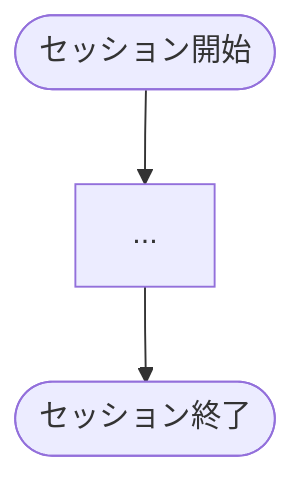
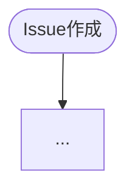
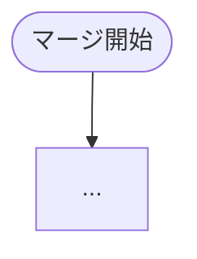

# カタログ生成

index.jsonから機能カタログとフロー図を生成する。

---

## 使い方

```
prompts/generate-catalog.md を読んで実行してください
```

対象プロジェクトを指定する場合:

```
prompts/generate-catalog.md を読んで、dekitaのカタログを生成してください
```

---

## 入力

`examples/<project>/.claude/index.json`

---

## 出力

`generated/catalog/<project>/` に以下を生成:

| ファイル | 内容 |
|---------|------|
| `README.md` | 機能カタログ（全機能一覧） |
| `flows.md` | フロー図（Mermaid） |

---

## 生成手順

### 1. index.json を読み込む

```bash
cat examples/<project>/.claude/index.json
```

### 2. README.md を生成

**全フック・スクリプト・スキルを出力する**（抜粋しない）。

以下の構造で作成:

```markdown
# <project> 機能カタログ

生成日時: YYYY-MM-DD

## 概要

[index.jsonのproject情報から]

## 統計

| カテゴリ | 数 |
|---------|---|
| フック | XX |
| スクリプト | XX |
| スキル | XX |

---

## フック一覧（全XX件）

| フック | 説明 |
|-------|------|
| `acceptance_criteria_reminder` | PR作成時に... |
| `active_worktree_check` | セッション開始時に... |
[... 全フックを出力 ...]

---

## スクリプト一覧（全XX件）

| スクリプト | 説明 |
|----------|------|
[... 全スクリプトを出力 ...]

---

## スキル一覧（全XX件）

| スキル | 説明 |
|-------|------|
[... 全スキルを出力 ...]

---

## 詳細情報

各フックの詳細（Why/What/keywords）は `index.json` を参照:

```bash
jq '.hooks[] | select(.name == "merge_check")' .claude/index.json
```
```

**jqでの一括出力例**:

```bash
# 全フックをMarkdownテーブル形式で出力
jq -r '.hooks[] | "| `\(.name)` | \(.summary | gsub("\n"; " ")) |"' \
  examples/<project>/.claude/index.json

# 全スクリプト
jq -r '.scripts[] | "| `\(.name)` | \(.summary | gsub("\n"; " ")) |"' \
  examples/<project>/.claude/index.json

# 全スキル
jq -r '.skills[] | "| `\(.name)` | \(.summary | gsub("\n"; " ")) |"' \
  examples/<project>/.claude/index.json
```

### 3. flows.md を生成

以下のフロー図を含める:

#### 3.1 開発ワークフロー全体像



**含める要素**:
- SessionStartフック群
- worktree作成
- 実装・コミット
- PR作成・CI待機
- AIレビュー対応
- マージ・クリーンアップ

#### 3.2 Issue作成フロー



**含める要素**:
- ラベルチェック
- 本文セクション確認
- 重複検出

#### 3.3 PRマージフロー



**含める要素**:
- merge_checkの各チェック項目
- AIレビュー確認
- 受け入れ基準確認

### 4. 出力ディレクトリに保存

```bash
mkdir -p generated/catalog/<project>
# README.md と flows.md を書き出し
```

---

## 生成時の注意

- index.jsonの情報のみを使用（ソースコードは読まない）
- **全機能を出力する**（主要機能だけに絞らない）
- フロー図はindex.jsonのtrigger/matcherから推測
- 不明な点は省略（推測で補わない）

---

## 出力例

生成完了後、以下を報告:

1. 生成したファイル一覧
2. 統計（フック数、スクリプト数等）
